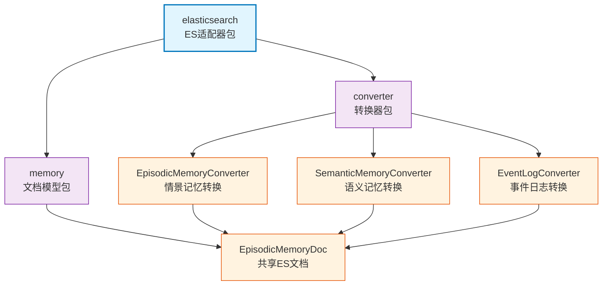

# infra_layer.adapters.out.search.elasticsearch

Elasticsearch 搜索适配器，提供基于 BM25 算法的高效文本检索功能，支持多词查询、智能分词和复杂过滤条件。

## 模块位置

**源码路径**: `src/infra_layer/adapters/out/search/elasticsearch/`
**文档路径**: `specs/ac_mod/infra_layer.adapters.out.search.elasticsearch.ac.mod.md`
**模块类型**: 包模块

## 目录结构

```
src/infra_layer/adapters/out/search/elasticsearch/
├── __init__.py                    # 包初始化
├── converter/                     # MongoDB → ES 转换器
│   ├── __init__.py                # 导出3个转换器
│   ├── episodic_memory_converter.py      # 情景记忆转换器
│   ├── semantic_memory_converter.py      # 语义记忆转换器
│   └── event_log_converter.py            # 事件日志转换器
└── memory/                        # ES 文档模型
    ├── __init__.py
    └── episodic_memory.py                # EpisodicMemoryDoc（共享文档模型）
```

## 快速开始

### 使用 ES 文档模型

```python
from infra_layer.adapters.out.search.elasticsearch.memory import EpisodicMemoryDoc

# 创建 ES 文档
doc = EpisodicMemoryDoc(
    event_id="evt123",
    user_id="user456",
    timestamp=datetime.now(),
    episode="讨论了项目进展",
    search_content=["项目", "进展", "讨论"]
)

# 保存到 ES
client = await get_es_client()
await doc.save(using=client)
```

### 使用转换器

```python
from infra_layer.adapters.out.search.elasticsearch.converter import (
    EpisodicMemoryConverter,
    SemanticMemoryConverter,
    EventLogConverter
)

# MongoDB → ES 转换
mongo_doc = await EpisodicMemory.objects.get(id="xxx")
es_doc = EpisodicMemoryConverter.from_mongo(mongo_doc)
await es_doc.save()
```

### 搜索文档

```python
from infra_layer.adapters.out.search.elasticsearch.memory import EpisodicMemoryDoc
from elasticsearch.dsl import Q

# BM25 搜索
search = EpisodicMemoryDoc.search()
search = search.query(
    Q("bool", should=[
        Q("match", search_content={"query": "项目", "boost": 2.0}),
        Q("match", search_content={"query": "进展", "boost": 1.5})
    ])
)
results = await search.execute()
```

## 核心组件详解

### 1. EpisodicMemoryDoc（共享文档模型）

**设计特点**：
- 单一文档模型，通过 `type` 字段区分记忆类型
- 支持三种类型：episode/personal_episode/group_episode、semantic_memory、event_log
- 基于 `AliasDoc` 实现，索引名：episodic-memory

**核心字段**：
| 字段 | 类型 | 用途 | 分析器 |
|------|------|------|--------|
| `event_id` | Keyword | 唯一标识 | - |
| `user_id` | Keyword | 用户过滤 | - |
| `timestamp` | Date | 时间过滤/排序 | - |
| `episode` | Text | 记忆内容 | whitespace_lowercase_trim_stop |
| `search_content` | Text(multi) | BM25检索核心 | standard + lower_keyword |
| `type` | Keyword | 类型过滤 | - |
| `group_id` | Keyword | 群组过滤 | - |
| `participants` | Keyword(multi) | 参与者过滤 | - |

**搜索字段设计**：
- `search_content`: 主字段（standard analyzer，支持分词）
- `search_content.original`: 子字段（lower_keyword analyzer，精确匹配）

### 2. Converter 层（3个转换器）

**EpisodicMemoryConverter**
- **from_mongo**: MongoDB EpisodicMemory → ES EpisodicMemoryDoc
- **分词**: 使用 jieba 分词 + stopwords 过滤
- **字段映射**: subject → title, episode → episode

**SemanticMemoryConverter**
- **from_mongo**: MongoDB SemanticMemory → ES EpisodicMemoryDoc
- **type 设置**: 自动设置 type=semantic_memory
- **分词**: 同 EpisodicMemoryConverter

**EventLogConverter**
- **from_mongo**: MongoDB EventLog → ES EpisodicMemoryDoc
- **type 设置**: 自动设置 type=event_log
- **分词**: 同 EpisodicMemoryConverter

### 3. 数据流转

```
MongoDB Document
  ↓
Converter.from_mongo(mongo_doc)
  ↓ jieba分词 + stopwords过滤
EpisodicMemoryDoc(search_content=[...])
  ↓
doc.save(using=client)
  ↓
Elasticsearch Index: episodic-memory
```

## Mermaid 依赖图



## 依赖关系说明

### 对其他模块的依赖
- `specs/ac_mod/core.oxm.es.ac.mod.md` - ES OXM基础（AliasDoc、BaseEsConverter）
- `specs/ac_mod/infra_layer.adapters.out.persistence.document.memory.ac.mod.md` - MongoDB文档
- `specs/ac_mod/core.nlp.ac.mod.md` - 分词工具（jieba、stopwords）
- `specs/ac_mod/common_utils.ac.mod.md` - 工具函数

### 被依赖关系
- `specs/ac_mod/infra_layer.adapters.out.search.repository.ac.mod.md` - Repository层使用文档模型
- `specs/ac_mod/biz_layer.ac.mod.md` - 业务层数据同步

## Grep 验证

```bash
# 验证转换器类定义
grep -r "class.*Converter" src/infra_layer/adapters/out/search/elasticsearch/converter/*.py

# 验证文档模型定义
grep "class EpisodicMemoryDoc" src/infra_layer/adapters/out/search/elasticsearch/memory/episodic_memory.py

# 验证 from_mongo 方法
grep -A 5 "def from_mongo" src/infra_layer/adapters/out/search/elasticsearch/converter/*.py

# 验证转换器导出
grep "__all__" src/infra_layer/adapters/out/search/elasticsearch/converter/__init__.py
```

## 可运行示例

### 转换器使用示例

```python
import asyncio
from datetime import datetime
from infra_layer.adapters.out.search.elasticsearch.converter import (
    EpisodicMemoryConverter,
    SemanticMemoryConverter,
    EventLogConverter
)
from infra_layer.adapters.out.persistence.document.memory.episodic_memory import (
    EpisodicMemory as MongoEpisodicMemory
)

async def test_converter():
    # 创建 MongoDB 文档
    mongo_doc = MongoEpisodicMemory(
        event_id="test123",
        user_id="user456",
        timestamp=datetime.now(),
        episode="我们讨论了新项目的技术架构，决定使用Python和FastAPI",
        subject="技术架构讨论"
    )

    # 转换为 ES 文档
    es_doc = EpisodicMemoryConverter.from_mongo(mongo_doc)

    # 查看分词结果
    print(f"Event ID: {es_doc.event_id}")
    print(f"Search Content: {es_doc.search_content}")
    print(f"Title: {es_doc.title}")

    # 保存到 ES（需要 ES 客户端）
    # await es_doc.save(using=client)

asyncio.run(test_converter())
```

### 文档创建示例

```python
from datetime import datetime
from infra_layer.adapters.out.search.elasticsearch.memory import EpisodicMemoryDoc

# 创建情景记忆文档
episodic_doc = EpisodicMemoryDoc(
    event_id="evt001",
    type="personal_episode",
    user_id="user123",
    timestamp=datetime.now(),
    episode="今天学习了Elasticsearch的BM25算法",
    search_content=["Elasticsearch", "BM25", "算法", "学习"]
)

# 创建语义记忆文档
semantic_doc = EpisodicMemoryDoc(
    event_id="sem001",
    type="semantic_memory",
    user_id="user123",
    timestamp=datetime.now(),
    episode="Elasticsearch使用倒排索引实现快速文本检索",
    search_content=["Elasticsearch", "倒排索引", "文本检索"]
)

print(f"Episodic Type: {episodic_doc.type}")
print(f"Semantic Type: {semantic_doc.type}")
```

### 搜索示例

```python
import asyncio
from elasticsearch.dsl import Q
from infra_layer.adapters.out.search.elasticsearch.memory import EpisodicMemoryDoc

async def test_search():
    # 多词 BM25 搜索
    search = EpisodicMemoryDoc.search()

    # 构建 bool 查询
    search = search.query(
        Q("bool",
          must=[
              Q("term", user_id="user123"),
              Q("term", type="personal_episode")
          ],
          should=[
              Q("match", search_content={"query": "Python", "boost": 2.0}),
              Q("match", search_content={"query": "FastAPI", "boost": 1.5})
          ],
          minimum_should_match=1
        )
    )

    # 执行搜索
    results = await search.execute()

    for hit in results:
        print(f"Score: {hit.meta.score}")
        print(f"Episode: {hit.episode[:100]}")
        print("---")

asyncio.run(test_search())
```

## 测试命令

```bash
# 测试转换器
pytest src/infra_layer/adapters/out/search/elasticsearch/converter/test_*.py -v

# 测试文档模型
pytest src/infra_layer/adapters/out/search/elasticsearch/memory/test_*.py -v

# 集成测试
pytest src/infra_layer/adapters/out/search/elasticsearch/ -v

# 验证导入
python -c "from infra_layer.adapters.out.search.elasticsearch.converter import EpisodicMemoryConverter; print(EpisodicMemoryConverter)"
```
