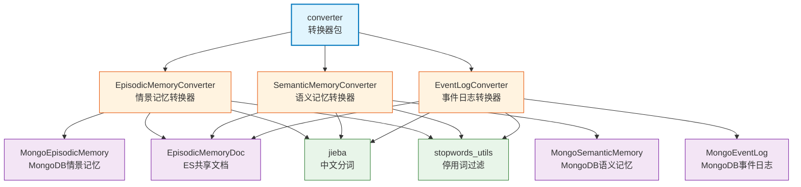

# infra_layer.adapters.out.search.elasticsearch.converter

Elasticsearch 转换器包，负责将 MongoDB 记忆文档转换为 Elasticsearch 文档，实现 jieba 分词、stopwords 过滤和字段映射。

## 模块位置

**源码路径**: `src/infra_layer/adapters/out/search/elasticsearch/converter/`
**文档路径**: `specs/ac_mod/infra_layer.adapters.out.search.elasticsearch.converter.ac.mod.md`
**模块类型**: 包模块

## 目录结构

```
src/infra_layer/adapters/out/search/elasticsearch/converter/
├── __init__.py                           # 导出3个转换器
├── episodic_memory_converter.py          # 情景记忆转换器
├── semantic_memory_converter.py          # 语义记忆转换器（复用EpisodicMemoryDoc）
└── event_log_converter.py                # 事件日志转换器（复用EpisodicMemoryDoc）
```

## 快速开始

### 基本转换

```python
from infra_layer.adapters.out.search.elasticsearch.converter import (
    EpisodicMemoryConverter,
    SemanticMemoryConverter,
    EventLogConverter
)
from infra_layer.adapters.out.persistence.document.memory.episodic_memory import (
    EpisodicMemory as MongoEpisodicMemory
)

# MongoDB → ES 转换
mongo_doc = await MongoEpisodicMemory.objects.get(id="xxx")
es_doc = EpisodicMemoryConverter.from_mongo(mongo_doc)

# 保存到 ES
await es_doc.save(using=client)
```

### 批量转换

```python
# 批量转换情景记忆
mongo_docs = await MongoEpisodicMemory.objects.filter(user_id="user123").to_list()
es_docs = [EpisodicMemoryConverter.from_mongo(doc) for doc in mongo_docs]

# 批量保存
for es_doc in es_docs:
    await es_doc.save(using=client)
```

### 查看分词结果

```python
# 转换并查看分词
es_doc = EpisodicMemoryConverter.from_mongo(mongo_doc)
print(f"Search Content: {es_doc.search_content}")
# 输出: ['讨论', '项目', '进展', '决定', 'Python', 'FastAPI']
```

## 核心组件详解

### 1. EpisodicMemoryConverter

**功能**: MongoDB EpisodicMemory → ES EpisodicMemoryDoc

**核心方法**:
- `from_mongo(source_doc: MongoEpisodicMemory) -> EpisodicMemoryDoc`
  - jieba 分词处理 episode 内容
  - stopwords 过滤（min_length=2）
  - 字段映射：subject → title, episode → episode

**字段映射表**:
| MongoDB字段 | ES字段 | 处理 |
|-------------|--------|------|
| `_id` | `event_id` | str转换 |
| `user_id` | `user_id` | 直接映射 |
| `timestamp` | `timestamp` | 直接映射 |
| `subject` | `title` | 直接映射 |
| `episode` | `episode` | 直接映射 |
| `episode` | `search_content` | jieba分词 + stopwords过滤 |
| `type` | `type` | 直接映射 |
| `group_id` | `group_id` | 直接映射 |
| `participants` | `participants` | 直接映射 |

**分词流程**:
```python
# 1. 收集文本
text = source_doc.episode

# 2. jieba分词
words = list(jieba.cut(text))

# 3. stopwords过滤
filtered = filter_stopwords(words, min_length=2)

# 4. 去除空白
search_content = [word.strip() for word in filtered if word.strip()]
```

### 2. SemanticMemoryConverter

**功能**: MongoDB SemanticMemory → ES EpisodicMemoryDoc (type=semantic_memory)

**核心方法**:
- `from_mongo(source_doc: MongoSemanticMemory) -> EpisodicMemoryDoc`
  - 自动设置 `type="semantic_memory"`
  - 字段映射：content → episode, evidence → summary
  - extend 字段存储额外信息（parent_episode_id、start_time、end_time等）

**特殊字段映射**:
| MongoDB字段 | ES字段 | 说明 |
|-------------|--------|------|
| `content` | `episode` | 语义记忆内容 |
| `evidence` | `summary` | 证据/依据 |
| `parent_episode_id` | `extend.parent_episode_id` | 父情景ID |
| `start_time` | `extend.start_time` | 有效期开始 |
| `end_time` | `extend.end_time` | 有效期结束 |
| `duration_days` | `extend.duration_days` | 持续天数 |

### 3. EventLogConverter

**功能**: MongoDB EventLog → ES EpisodicMemoryDoc (type=event_log)

**核心方法**:
- `from_mongo(source_doc: MongoEventLog) -> EpisodicMemoryDoc`
  - 自动设置 `type="event_log"`
  - 字段映射：atomic_fact → episode
  - extend 字段存储 parent_episode_id、atomic_fact

**特殊字段映射**:
| MongoDB字段 | ES字段 | 说明 |
|-------------|--------|------|
| `atomic_fact` | `episode` | 原子事实 |
| `parent_episode_id` | `extend.parent_episode_id` | 父情景ID |
| `atomic_fact` | `extend.atomic_fact` | 冗余存储 |

### 4. 共同特性

**基类**: 所有转换器继承自 `BaseEsConverter[EpisodicMemoryDoc]`

**共同处理**:
- jieba 中文分词
- stopwords 过滤（min_length=2）
- 异常处理和日志记录
- 字段默认值处理

## Mermaid 依赖图



## 依赖关系说明

### 对其他模块的依赖
- `specs/ac_mod/core.oxm.es.base_converter.ac.mod.md` - BaseEsConverter 基类
- `specs/ac_mod/infra_layer.adapters.out.search.elasticsearch.memory.ac.mod.md` - EpisodicMemoryDoc
- `specs/ac_mod/infra_layer.adapters.out.persistence.document.memory.ac.mod.md` - MongoDB 文档
- `specs/ac_mod/core.nlp.ac.mod.md` - jieba、stopwords_utils
- `specs/ac_mod/core.observation.logger.ac.mod.md` - 日志工具

### 被依赖关系
- `specs/ac_mod/biz_layer.personal_memory_sync.ac.mod.md` - 个人记忆同步
- `specs/ac_mod/biz_layer.memcell_sync.ac.mod.md` - 记忆单元同步
- `specs/ac_mod/devops_scripts.data_fix.ac.mod.md` - 数据修复脚本

## Grep 验证

```bash
# 验证转换器类定义
grep "class.*Converter" src/infra_layer/adapters/out/search/elasticsearch/converter/*.py

# 验证 from_mongo 方法
grep -A 10 "def from_mongo" src/infra_layer/adapters/out/search/elasticsearch/converter/episodic_memory_converter.py

# 验证 jieba 分词使用
grep "jieba.cut" src/infra_layer/adapters/out/search/elasticsearch/converter/*.py

# 验证 stopwords 过滤
grep "filter_stopwords" src/infra_layer/adapters/out/search/elasticsearch/converter/*.py

# 验证导出
grep "__all__" src/infra_layer/adapters/out/search/elasticsearch/converter/__init__.py
```

## 可运行示例

### 情景记忆转换

```python
from datetime import datetime
from infra_layer.adapters.out.search.elasticsearch.converter import EpisodicMemoryConverter
from infra_layer.adapters.out.persistence.document.memory.episodic_memory import (
    EpisodicMemory as MongoEpisodicMemory
)

# 创建 MongoDB 文档
mongo_doc = MongoEpisodicMemory(
    event_id="test123",
    user_id="user456",
    timestamp=datetime.now(),
    episode="我们讨论了新项目的技术架构，决定使用Python和FastAPI框架",
    subject="技术架构讨论"
)

# 转换为 ES 文档
es_doc = EpisodicMemoryConverter.from_mongo(mongo_doc)

# 查看转换结果
print(f"Event ID: {es_doc.event_id}")
print(f"User ID: {es_doc.user_id}")
print(f"Title: {es_doc.title}")
print(f"Episode: {es_doc.episode}")
print(f"Search Content: {es_doc.search_content}")
# 输出: ['讨论', '项目', '技术架构', '决定', 'Python', 'FastAPI', '框架']
```

### 语义记忆转换

```python
from infra_layer.adapters.out.search.elasticsearch.converter import SemanticMemoryConverter

# MongoDB 语义记忆（假设结构）
class MockSemanticMemory:
    def __init__(self):
        self.memory_id = "sem001"
        self.user_id = "user123"
        self.timestamp = datetime.now()
        self.content = "Python是一门高级编程语言"
        self.evidence = "官方文档说明"
        self.parent_episode_id = "episode001"

mongo_sem = MockSemanticMemory()
es_doc = SemanticMemoryConverter.from_mongo(mongo_sem)

print(f"Type: {es_doc.type}")  # semantic_memory
print(f"Episode: {es_doc.episode}")  # Python是一门高级编程语言
print(f"Summary: {es_doc.summary}")  # 官方文档说明
print(f"Extend: {es_doc.extend}")  # {'parent_episode_id': 'episode001', ...}
```

### 事件日志转换

```python
from infra_layer.adapters.out.search.elasticsearch.converter import EventLogConverter

# MongoDB 事件日志（假设结构）
class MockEventLog:
    def __init__(self):
        self.log_id = "log001"
        self.user_id = "user123"
        self.timestamp = datetime.now()
        self.atomic_fact = "用户登录系统"
        self.parent_episode_id = "episode002"

mongo_log = MockEventLog()
es_doc = EventLogConverter.from_mongo(mongo_log)

print(f"Type: {es_doc.type}")  # event_log
print(f"Episode: {es_doc.episode}")  # 用户登录系统
print(f"Extend: {es_doc.extend}")  # {'parent_episode_id': 'episode002', 'atomic_fact': '用户登录系统'}
```

### 批量转换示例

```python
import asyncio
from infra_layer.adapters.out.search.elasticsearch.converter import EpisodicMemoryConverter

async def batch_convert():
    # 从 MongoDB 获取文档
    mongo_docs = await MongoEpisodicMemory.objects.filter(
        user_id="user123"
    ).limit(100).to_list()

    # 批量转换
    es_docs = []
    for mongo_doc in mongo_docs:
        try:
            es_doc = EpisodicMemoryConverter.from_mongo(mongo_doc)
            es_docs.append(es_doc)
        except Exception as e:
            print(f"转换失败: {mongo_doc.event_id}, 错误: {e}")

    print(f"成功转换 {len(es_docs)} 个文档")

    # 批量保存到 ES
    client = await get_es_client()
    for es_doc in es_docs:
        await es_doc.save(using=client)

asyncio.run(batch_convert())
```

## 测试命令

```bash
# 测试所有转换器
pytest src/infra_layer/adapters/out/search/elasticsearch/converter/test_*.py -v

# 测试单个转换器
pytest src/infra_layer/adapters/out/search/elasticsearch/converter/test_episodic_memory_converter.py -v

# 验证导入
python -c "from infra_layer.adapters.out.search.elasticsearch.converter import EpisodicMemoryConverter, SemanticMemoryConverter, EventLogConverter; print('OK')"

# 测试 jieba 分词
python -c "
import jieba
from core.nlp.stopwords_utils import filter_stopwords

text = '我们讨论了新项目的技术架构'
words = list(jieba.cut(text))
filtered = filter_stopwords(words, min_length=2)
print(filtered)
"
```
