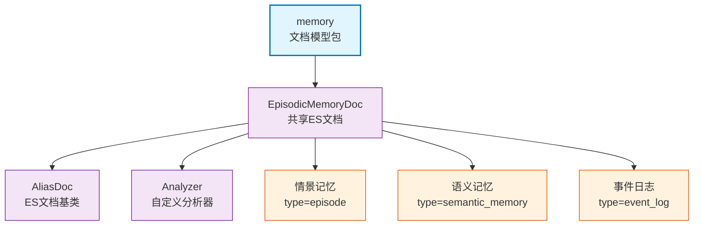

# infra_layer.adapters.out.search.elasticsearch.memory

Elasticsearch 文档模型包，提供 `EpisodicMemoryDoc` 共享文档模型，通过 `type` 字段支持情景记忆、语义记忆、事件日志三种记忆类型。

## 模块位置

**源码路径**: `src/infra_layer/adapters/out/search/elasticsearch/memory/episodic_memory.py`
**文档路径**: `specs/ac_mod/infra_layer.adapters.out.search.elasticsearch.memory.ac.mod.md`
**模块类型**: 单文件模块

## 文件结构

```python
# episodic_memory.py 内容结构
├── 导入部分                    # elasticsearch.dsl、core.oxm、analyzer
├── EpisodicMemoryDoc           # 共享ES文档类（核心）
│   ├── ID_SOURCE_FIELD        # 主键字段名："event_id"
│   ├── 基础标识字段           # event_id、user_id、user_name
│   ├── 时间字段               # timestamp
│   ├── 核心内容字段           # title、episode、search_content、summary
│   ├── 分类标签字段           # group_id、participants、type、keywords等
│   └── 审计字段               # created_at、updated_at
```

## 快速开始

### 创建文档

```python
from datetime import datetime
from infra_layer.adapters.out.search.elasticsearch.memory import EpisodicMemoryDoc

# 创建情景记忆文档
doc = EpisodicMemoryDoc(
    event_id="evt001",
    user_id="user123",
    timestamp=datetime.now(),
    type="personal_episode",
    episode="参加了技术分享会，学习了Elasticsearch",
    search_content=["技术分享", "Elasticsearch", "学习"]
)

# 保存到 ES
await doc.save(using=client)
```

### 搜索文档

```python
from elasticsearch.dsl import Q

# BM25 搜索
search = EpisodicMemoryDoc.search()
search = search.query(
    Q("bool",
      must=[Q("term", user_id="user123")],
      should=[
          Q("match", search_content="Elasticsearch"),
          Q("match", search_content="技术")
      ],
      minimum_should_match=1
    )
)

results = await search.execute()
for hit in results:
    print(f"{hit.event_id}: {hit.episode}")
```

### 通过 type 区分记忆类型

```python
# 创建语义记忆（共享文档，type=semantic_memory）
semantic_doc = EpisodicMemoryDoc(
    event_id="sem001",
    type="semantic_memory",
    user_id="user123",
    timestamp=datetime.now(),
    episode="Python是面向对象的编程语言",
    search_content=["Python", "面向对象", "编程语言"]
)

# 创建事件日志（共享文档，type=event_log）
event_doc = EpisodicMemoryDoc(
    event_id="log001",
    type="event_log",
    user_id="user123",
    timestamp=datetime.now(),
    episode="用户登录系统",
    search_content=["用户", "登录", "系统"]
)
```

## 核心组件详解

### 1. EpisodicMemoryDoc

**基类**: `AliasDoc("episodic-memory", number_of_shards=3)`
- **索引名称**: `episodic-memory`
- **分片数量**: 3
- **主键字段**: `event_id` (通过 `ID_SOURCE_FIELD` 配置)

**字段定义**:

| 字段 | 类型 | 必需 | 用途 | 分析器/特性 |
|------|------|------|------|-------------|
| `event_id` | Keyword | ✅ | 唯一标识 | 精确匹配 |
| `user_id` | Keyword | ✅ | 用户过滤 | 精确匹配 |
| `user_name` | Keyword | ❌ | 用户名 | 精确匹配 |
| `timestamp` | Date | ✅ | 时间过滤/排序 | 日期类型 |
| `title` | Text | ❌ | 标题 | whitespace_lowercase_trim_stop + keyword子字段 |
| `episode` | Text | ✅ | 核心内容 | whitespace_lowercase_trim_stop + keyword子字段 |
| `search_content` | Text(multi) | ✅ | BM25检索核心 | standard + lower_keyword子字段 |
| `summary` | Text | ❌ | 摘要 | whitespace_lowercase_trim_stop |
| `group_id` | Keyword | ❌ | 群组过滤 | 精确匹配 |
| `participants` | Keyword(multi) | ❌ | 参与者列表 | 精确匹配 |
| `type` | Keyword | ❌ | 类型标识 | episode/semantic_memory/event_log |
| `keywords` | Keyword(multi) | ❌ | 关键词 | 精确匹配 |
| `linked_entities` | Keyword(multi) | ❌ | 关联实体 | 精确匹配 |
| `subject` | Text | ❌ | 主题 | 文本检索 |
| `memcell_event_id_list` | Keyword(multi) | ❌ | 记忆单元ID | 精确匹配 |
| `extend` | Object | ❌ | 扩展字段 | 动态字段 |
| `created_at` | Date | ❌ | 创建时间 | 日期类型 |
| `updated_at` | Date | ❌ | 更新时间 | 日期类型 |

### 2. 核心搜索字段：search_content

**字段设计**:
```python
search_content = e_field.Text(
    multi=True,              # 支持多值存储
    required=True,
    analyzer="standard",     # 主字段：standard analyzer（支持分词）
    fields={
        "original": e_field.Text(
            analyzer=lower_keyword_analyzer,        # 子字段：精确匹配（小写）
            search_analyzer=lower_keyword_analyzer
        )
    }
)
```

**两种匹配模式**:
1. **分词匹配**: `search_content` 主字段 → standard analyzer
2. **精确匹配**: `search_content.original` 子字段 → lower_keyword analyzer

**使用场景**:
```python
# 分词匹配（模糊）
Q("match", search_content="Python编程")  # 匹配 "Python" 或 "编程"

# 精确匹配
Q("term", search_content__original="python")  # 精确匹配 "python"（小写）
```

### 3. 三种记忆类型支持

**通过 type 字段区分**:
| type 值 | 记忆类型 | 用途 |
|---------|---------|------|
| `episode` / `personal_episode` / `group_episode` | 情景记忆 | 个人/群组对话、事件 |
| `semantic_memory` | 语义记忆 | 长期知识、规律 |
| `event_log` | 事件日志 | 原子事实、操作日志 |

**优势**:
- 单一索引，减少维护成本
- 统一查询接口
- 共享字段定义

### 4. 分析器配置

**自定义分析器**（from `core.oxm.es.analyzer`）:
- `whitespace_lowercase_trim_stop_analyzer`: 空格分词 + 小写 + 去空白 + 停用词
- `lower_keyword_analyzer`: 小写 + 精确匹配
- `completion_analyzer`: 自动补全分析器
- `edge_analyzer`: 边缘N-gram（前缀匹配）

## Mermaid 依赖图



## 依赖关系说明

### 对其他模块的依赖
- `specs/ac_mod/core.oxm.es.doc_base.ac.mod.md` - AliasDoc 基类
- `specs/ac_mod/core.oxm.es.analyzer.ac.mod.md` - 自定义分析器
- `elasticsearch_dsl` - ES DSL 库

### 被依赖关系
- `specs/ac_mod/infra_layer.adapters.out.search.elasticsearch.converter.ac.mod.md` - 转换器使用文档
- `specs/ac_mod/infra_layer.adapters.out.search.repository.ac.mod.md` - Repository 使用文档
- `specs/ac_mod/biz_layer.ac.mod.md` - 业务层使用

## Grep 验证

```bash
# 验证文档类定义
grep "class EpisodicMemoryDoc" src/infra_layer/adapters/out/search/elasticsearch/memory/episodic_memory.py

# 验证字段定义
grep "e_field\." src/infra_layer/adapters/out/search/elasticsearch/memory/episodic_memory.py

# 验证 search_content 字段配置
grep -A 10 "search_content = " src/infra_layer/adapters/out/search/elasticsearch/memory/episodic_memory.py

# 验证 ID_SOURCE_FIELD
grep "ID_SOURCE_FIELD" src/infra_layer/adapters/out/search/elasticsearch/memory/episodic_memory.py

# 验证使用情况
grep "EpisodicMemoryDoc" src/infra_layer/adapters/out/search/repository/*.py
```

## 可运行示例

### 创建不同类型的记忆文档

```python
from datetime import datetime
from infra_layer.adapters.out.search.elasticsearch.memory import EpisodicMemoryDoc

# 1. 情景记忆
episodic_doc = EpisodicMemoryDoc(
    event_id="evt001",
    type="personal_episode",
    user_id="user123",
    timestamp=datetime.now(),
    title="技术分享会",
    episode="参加了公司的Python技术分享会，学习了async编程",
    search_content=["技术分享", "Python", "async", "编程"],
    keywords=["技术", "学习"],
    extend={"location": "会议室A"}
)

# 2. 语义记忆
semantic_doc = EpisodicMemoryDoc(
    event_id="sem001",
    type="semantic_memory",
    user_id="user123",
    timestamp=datetime.now(),
    episode="Python的async/await是基于协程的异步编程模型",
    search_content=["Python", "async", "await", "协程", "异步编程"],
    summary="技术分享会学习笔记",
    extend={
        "parent_episode_id": "evt001",
        "evidence": "官方文档"
    }
)

# 3. 事件日志
event_doc = EpisodicMemoryDoc(
    event_id="log001",
    type="event_log",
    user_id="user123",
    timestamp=datetime.now(),
    episode="用户报名参加技术分享会",
    search_content=["用户", "报名", "技术分享"],
    extend={
        "parent_episode_id": "evt001",
        "atomic_fact": "用户报名参加技术分享会"
    }
)

print(f"Episodic: {episodic_doc.type}")
print(f"Semantic: {semantic_doc.type}")
print(f"EventLog: {event_doc.type}")
```

### BM25 搜索示例

```python
import asyncio
from elasticsearch.dsl import Q
from infra_layer.adapters.out.search.elasticsearch.memory import EpisodicMemoryDoc

async def search_example():
    # 构建多词 BM25 查询
    search = EpisodicMemoryDoc.search()

    # 过滤条件 + 多词搜索
    search = search.query(
        Q("bool",
          must=[
              Q("term", user_id="user123"),
              Q("term", type="personal_episode")
          ],
          should=[
              Q("match", search_content={"query": "Python", "boost": 2.0}),
              Q("match", search_content={"query": "async", "boost": 1.5}),
              Q("match", search_content={"query": "编程", "boost": 1.0})
          ],
          minimum_should_match=1
        )
    )

    # 按相关性排序
    search = search.sort({"_score": {"order": "desc"}})

    # 执行查询
    results = await search.execute()

    for hit in results:
        print(f"ID: {hit.event_id}, Score: {hit.meta.score}")
        print(f"Episode: {hit.episode[:100]}...")
        print(f"Search Content: {hit.search_content[:5]}")
        print("---")

asyncio.run(search_example())
```

### 字段子查询示例

```python
# 精确匹配 vs 分词匹配
search = EpisodicMemoryDoc.search()

# 1. 分词匹配（模糊）
search_fuzzy = search.query(
    Q("match", search_content="Python编程")  # 匹配 "Python" 或 "编程"
)

# 2. 精确匹配（使用 original 子字段）
search_exact = search.query(
    Q("term", search_content__original="python")  # 精确匹配 "python"
)

# 3. 关键词字段精确匹配
search_keyword = search.query(
    Q("term", title__keyword="Python技术分享")  # title.keyword 子字段
)
```

## 测试命令

```bash
# 测试文档模型
pytest src/infra_layer/adapters/out/search/elasticsearch/memory/test_*.py -v

# 验证导入
python -c "from infra_layer.adapters.out.search.elasticsearch.memory import EpisodicMemoryDoc; print(EpisodicMemoryDoc._index._name)"

# 查看字段定义
python -c "
from infra_layer.adapters.out.search.elasticsearch.memory import EpisodicMemoryDoc
print('Fields:', list(EpisodicMemoryDoc._doc_type.mapping))
"

# 测试文档创建
python -c "
from datetime import datetime
from infra_layer.adapters.out.search.elasticsearch.memory import EpisodicMemoryDoc

doc = EpisodicMemoryDoc(
    event_id='test',
    user_id='user1',
    timestamp=datetime.now(),
    episode='test',
    search_content=['test']
)
print('Doc created:', doc.event_id)
"
```
