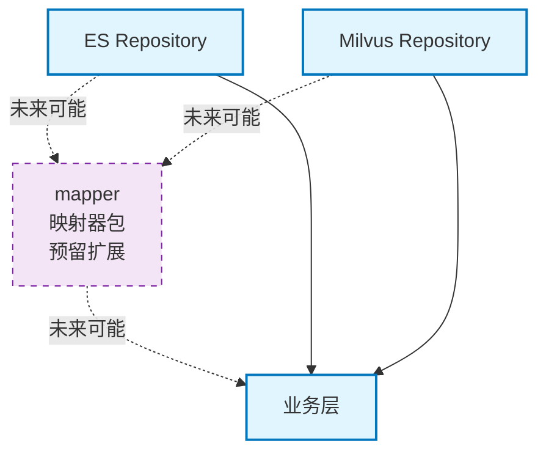

# infra_layer.adapters.out.search.mapper

搜索结果映射器包，负责将搜索引擎返回的原始数据映射为应用层所需的标准格式（当前为空包，预留扩展）。

## 模块位置

**源码路径**: `src/infra_layer/adapters/out/search/mapper/`
**文档路径**: `specs/ac_mod/infra_layer.adapters.out.search.mapper.ac.mod.md`
**模块类型**: 包模块

## 目录结构

```
src/infra_layer/adapters/out/search/mapper/
└── __init__.py                    # 空包（预留扩展）
```

## 快速开始

### 当前状态

mapper 包当前为空包，暂无具体实现。Repository 层直接返回搜索引擎的原始结果。

### 预期用途（未来扩展）

```python
# 未来可能的使用方式
from infra_layer.adapters.out.search.mapper import (
    EsResultMapper,
    MilvusResultMapper
)

# ES 结果映射
es_hits = await es_repo.multi_search(query=["Python"])
mapped_results = EsResultMapper.map_to_domain(es_hits)

# Milvus 结果映射
milvus_results = await milvus_repo.vector_search(vector=[...])
mapped_results = MilvusResultMapper.map_to_domain(milvus_results)
```

## 核心组件详解

### 1. 当前架构

**直接返回原始数据**：
- ES Repository → 直接返回 `hits` 数组
- Milvus Repository → 直接返回实体字典数组
- 业务层自行处理结果格式

### 2. 未来可能的扩展

**结果映射器**（未实现）:
- `EsResultMapper`: ES hits → 标准格式
- `MilvusResultMapper`: Milvus entities → 标准格式
- `UnifiedResultMapper`: 统一两种引擎的返回格式

**可能的映射功能**:
- 字段名称标准化
- 数据类型转换
- 元数据解析（JSON → Dict）
- 分页信息封装
- 得分归一化

### 3. 为什么当前为空

**设计考虑**:
1. **简化架构**: 避免过度设计，Repository 直接返回原始数据更灵活
2. **性能考虑**: 减少一层转换，提高查询效率
3. **业务差异**: 不同业务对结果格式要求不同，统一映射可能不适用
4. **YAGNI 原则**: "You Aren't Gonna Need It"，暂不实现未确定需求的功能

## Mermaid 依赖图



## 依赖关系说明

### 对其他模块的依赖
- 无（当前为空包）

### 被依赖关系
- 无（当前未被使用）

## Grep 验证

```bash
# 验证 mapper 包内容
ls -la src/infra_layer/adapters/out/search/mapper/

# 验证是否有其他文件
find src/infra_layer/adapters/out/search/mapper/ -name "*.py"

# 验证 __init__.py 内容
cat src/infra_layer/adapters/out/search/mapper/__init__.py
```

## 可运行示例

### 当前使用方式（无映射）

```python
from infra_layer.adapters.out.search.repository import EpisodicMemoryEsRepository

# ES 检索，直接使用原始结果
repo = EpisodicMemoryEsRepository()
results = await repo.multi_search(query=["Python"], user_id="user123")

# results 是原始 ES hits 数组
for hit in results:
    print(f"ID: {hit['_id']}")
    print(f"Score: {hit['_score']}")
    print(f"Source: {hit['_source']}")
```

### 未来可能的使用方式

```python
# 示例：如果未来实现了映射器
from infra_layer.adapters.out.search.mapper import EsResultMapper

# ES 检索
raw_results = await repo.multi_search(query=["Python"])

# 映射为标准格式
mapped_results = EsResultMapper.map_to_domain(raw_results)

# 统一格式
for result in mapped_results:
    print(f"ID: {result.id}")
    print(f"Score: {result.relevance_score}")
    print(f"Content: {result.content}")
    print(f"Metadata: {result.metadata}")
```

## 测试命令

```bash
# 验证包导入（当前为空）
python -c "import infra_layer.adapters.out.search.mapper; print('OK')"

# 查看包内容
python -c "
import infra_layer.adapters.out.search.mapper as mapper
print(dir(mapper))
"
```

## 扩展建议

如果未来需要实现 mapper，可以考虑以下设计：

### 1. 标准结果格式

```python
from dataclasses import dataclass
from typing import Any, Dict

@dataclass
class SearchResult:
    """统一的搜索结果格式"""
    id: str
    score: float
    content: str
    metadata: Dict[str, Any]
    source: str  # "es" or "milvus"
```

### 2. 映射器接口

```python
from abc import ABC, abstractmethod
from typing import List

class ResultMapper(ABC):
    """结果映射器基类"""

    @abstractmethod
    def map_to_domain(self, raw_results: Any) -> List[SearchResult]:
        """将原始结果映射为领域对象"""
        pass
```

### 3. 具体实现

```python
class EsResultMapper(ResultMapper):
    """ES 结果映射器"""

    def map_to_domain(self, es_hits: List[Dict]) -> List[SearchResult]:
        results = []
        for hit in es_hits:
            results.append(SearchResult(
                id=hit['_id'],
                score=hit['_score'],
                content=hit['_source'].get('episode', ''),
                metadata=hit['_source'],
                source="es"
            ))
        return results
```
