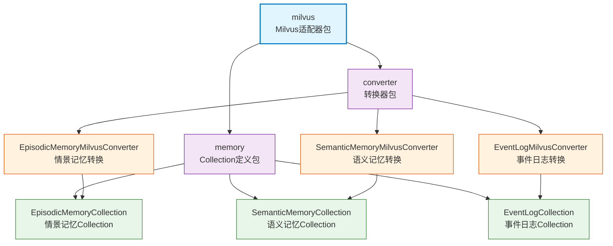

# infra_layer.adapters.out.search.milvus

Milvus 搜索适配器，提供基于向量相似度的高效语义检索功能，支持 HNSW 索引和 COSINE 相似度计算。

## 模块位置

**源码路径**: `src/infra_layer/adapters/out/search/milvus/`
**文档路径**: `specs/ac_mod/infra_layer.adapters.out.search.milvus.ac.mod.md`
**模块类型**: 包模块

## 目录结构

```
src/infra_layer/adapters/out/search/milvus/
├── __init__.py                    # 包初始化
├── converter/                     # MongoDB → Milvus 转换器
│   ├── __init__.py                # 导出3个转换器
│   ├── episodic_memory_milvus_converter.py      # 情景记忆转换器
│   ├── semantic_memory_milvus_converter.py      # 语义记忆转换器
│   └── event_log_milvus_converter.py            # 事件日志转换器
└── memory/                        # Milvus Collection 定义
    ├── __init__.py                # 导出3个 Collection
    ├── episodic_memory_collection.py            # EpisodicMemoryCollection
    ├── semantic_memory_collection.py            # SemanticMemoryCollection
    └── event_log_collection.py                  # EventLogCollection
```

## 快速开始

### 使用 Collection

```python
from infra_layer.adapters.out.search.milvus.memory import EpisodicMemoryCollection

# 获取 Collection 实例
collection = EpisodicMemoryCollection()

# 插入向量数据
entity = {
    "id": "evt001",
    "vector": [0.1, 0.2, ...],  # 1024维向量
    "user_id": "user123",
    "episode": "参加了技术分享会"
}
await collection.async_collection().insert([entity])
```

### 使用转换器

```python
from infra_layer.adapters.out.search.milvus.converter import EpisodicMemoryMilvusConverter
from infra_layer.adapters.out.persistence.document.memory.episodic_memory import EpisodicMemory

# MongoDB → Milvus 转换
mongo_doc = await EpisodicMemory.objects.get(id="xxx")
milvus_entity = EpisodicMemoryMilvusConverter.from_mongo(mongo_doc)

# 插入 Milvus
collection = EpisodicMemoryCollection()
await collection.async_collection().insert([milvus_entity])
```

### 向量检索

```python
# 相似度搜索
query_vector = [0.1, 0.2, ...]  # 1024维向量

results = await collection.async_collection().search(
    data=[query_vector],
    anns_field="vector",
    param={"metric_type": "COSINE", "params": {"ef": 100}},
    limit=10,
    expr='user_id == "user123"'
)
```

## 核心组件详解

### 1. 三个独立 Collection

与 Elasticsearch 不同，Milvus 使用三个独立的 Collection：

| Collection | 用途 | Schema 特点 |
|------------|------|------------|
| **EpisodicMemoryCollection** | 情景记忆 | episode、event_type、participants |
| **SemanticMemoryCollection** | 语义记忆 | content、evidence、start_time/end_time |
| **EventLogCollection** | 事件日志 | atomic_fact、parent_episode_id |

**设计原因**：
- 每种记忆类型的字段需求不同
- Milvus 不支持灵活的 dynamic 字段
- 独立 Collection 便于优化索引策略

### 2. 向量配置

**向量维度**: 1024（BAAI/bge-m3 模型）
**索引类型**: HNSW（Hierarchical Navigable Small World）
**相似度度量**: COSINE（余弦相似度）

**HNSW 参数**:
```python
{
    "M": 16,                # 每个节点的最大边数
    "efConstruction": 200   # 构建时的搜索宽度
}
```

### 3. 通用字段

所有 Collection 共享的字段：

| 字段 | 类型 | 用途 |
|------|------|------|
| `id` | VARCHAR(100) | 主键 |
| `vector` | FLOAT_VECTOR(1024) | 文本向量 |
| `user_id` | VARCHAR(100) | 用户过滤 |
| `group_id` | VARCHAR(100) | 群组过滤 |
| `participants` | ARRAY[VARCHAR] | 参与者列表 |
| `search_content` | VARCHAR(5000) | 搜索内容（JSON） |
| `metadata` | VARCHAR(50000) | 元数据（JSON） |
| `created_at` | INT64 | 创建时间戳 |
| `updated_at` | INT64 | 更新时间戳 |

### 4. 索引配置

**向量索引**（所有 Collection）:
```python
IndexConfig(
    field_name="vector",
    index_type="HNSW",
    metric_type="COSINE",
    params={"M": 16, "efConstruction": 200}
)
```

**标量索引**（自动选择）:
```python
IndexConfig(field_name="user_id", index_type="AUTOINDEX")
IndexConfig(field_name="group_id", index_type="AUTOINDEX")
```

## Mermaid 依赖图



## 依赖关系说明

### 对其他模块的依赖
- `specs/ac_mod/core.oxm.milvus.ac.mod.md` - MilvusCollectionWithSuffix、BaseMilvusConverter
- `specs/ac_mod/infra_layer.adapters.out.persistence.document.memory.ac.mod.md` - MongoDB文档
- `pymilvus` - Milvus Python SDK

### 被依赖关系
- `specs/ac_mod/infra_layer.adapters.out.search.repository.ac.mod.md` - Repository层使用
- `specs/ac_mod/biz_layer.ac.mod.md` - 业务层数据同步

## Grep 验证

```bash
# 验证 Collection 定义
grep "class.*Collection" src/infra_layer/adapters/out/search/milvus/memory/*.py

# 验证转换器定义
grep "class.*Converter" src/infra_layer/adapters/out/search/milvus/converter/*.py

# 验证索引配置
grep "IndexConfig" src/infra_layer/adapters/out/search/milvus/memory/*.py

# 验证向量维度
grep "dim=1024" src/infra_layer/adapters/out/search/milvus/memory/*.py

# 验证导出
grep "__all__" src/infra_layer/adapters/out/search/milvus/*/__ init__.py
```

## 可运行示例

### Collection 创建和使用

```python
import asyncio
from infra_layer.adapters.out.search.milvus.memory import EpisodicMemoryCollection

async def test_collection():
    # 初始化 Collection
    collection = EpisodicMemoryCollection()

    # 准备实体数据
    entity = {
        "id": "evt001",
        "vector": [0.1] * 1024,  # 1024维向量
        "user_id": "user123",
        "group_id": "",
        "participants": ["user123", "user456"],
        "event_type": "conversation",
        "timestamp": 1234567890,
        "episode": "参加了技术分享会",
        "search_content": '["技术分享", "会议"]',
        "metadata": '{"location": "会议室A"}',
        "created_at": 1234567890,
        "updated_at": 1234567890
    }

    # 插入数据
    await collection.async_collection().insert([entity])
    print("✅ 插入成功")

asyncio.run(test_collection())
```

### 转换器使用示例

```python
from infra_layer.adapters.out.search.milvus.converter import EpisodicMemoryMilvusConverter
from datetime import datetime

# 模拟 MongoDB 文档
class MockMongoDoc:
    def __init__(self):
        self.event_id = "evt001"
        self.user_id = "user123"
        self.timestamp = datetime.now()
        self.episode = "参加了技术分享会"
        self.type = "conversation"
        self.vector = [0.1] * 1024
        self.created_at = datetime.now()
        self.updated_at = datetime.now()

mongo_doc = MockMongoDoc()

# 转换为 Milvus 实体
milvus_entity = EpisodicMemoryMilvusConverter.from_mongo(mongo_doc)

print(f"ID: {milvus_entity['id']}")
print(f"User ID: {milvus_entity['user_id']}")
print(f"Vector length: {len(milvus_entity['vector'])}")
print(f"Episode: {milvus_entity['episode']}")
```

### 向量检索示例

```python
import asyncio
from infra_layer.adapters.out.search.milvus.memory import EpisodicMemoryCollection

async def vector_search_example():
    collection = EpisodicMemoryCollection()

    # 查询向量（实际应从 embedding 模型获取）
    query_vector = [0.1] * 1024

    # 执行向量检索
    results = await collection.async_collection().search(
        data=[query_vector],
        anns_field="vector",
        param={
            "metric_type": "COSINE",
            "params": {"ef": 100}  # HNSW 搜索参数
        },
        limit=10,
        expr='user_id == "user123"',  # 用户过滤
        output_fields=["id", "episode", "timestamp"]
    )

    for hits in results:
        for hit in hits:
            print(f"ID: {hit.id}, Distance: {hit.distance}")
            print(f"Episode: {hit.entity.get('episode')}")
            print("---")

asyncio.run(vector_search_example())
```

## 测试命令

```bash
# 测试 Collection 定义
pytest src/infra_layer/adapters/out/search/milvus/memory/test_*.py -v

# 测试转换器
pytest src/infra_layer/adapters/out/search/milvus/converter/test_*.py -v

# 验证导入
python -c "from infra_layer.adapters.out.search.milvus.memory import EpisodicMemoryCollection, SemanticMemoryCollection, EventLogCollection; print('OK')"

# 验证转换器导入
python -c "from infra_layer.adapters.out.search.milvus.converter import EpisodicMemoryMilvusConverter, SemanticMemoryMilvusConverter, EventLogMilvusConverter; print('OK')"
```
