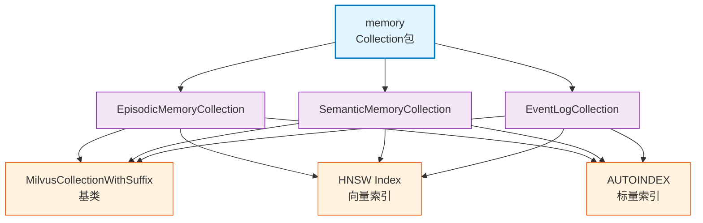

# infra_layer.adapters.out.search.milvus.memory

Milvus Collection 定义包，提供三个独立 Collection（EpisodicMemoryCollection、SemanticMemoryCollection、EventLogCollection），支持 HNSW 索引和 COSINE 相似度。

## 模块位置

**源码路径**: `src/infra_layer/adapters/out/search/milvus/memory/`
**文档路径**: `specs/ac_mod/infra_layer.adapters.out.search.milvus.memory.ac.mod.md`
**模块类型**: 包模块

## 目录结构

```
src/infra_layer/adapters/out/search/milvus/memory/
├── __init__.py                           # 导出3个 Collection
├── episodic_memory_collection.py         # 情景记忆 Collection
├── semantic_memory_collection.py         # 语义记忆 Collection
└── event_log_collection.py               # 事件日志 Collection
```

## 快速开始

### 创建 Collection

```python
from infra_layer.adapters.out.search.milvus.memory import (
    EpisodicMemoryCollection,
    SemanticMemoryCollection,
    EventLogCollection
)

# 初始化 Collection
episodic_coll = EpisodicMemoryCollection()
semantic_coll = SemanticMemoryCollection()
event_coll = EventLogCollection()

# 获取异步 Collection
async_coll = episodic_coll.async_collection()
```

### 插入数据

```python
# 准备实体
entity = {
    "id": "evt001",
    "vector": [0.1] * 1024,  # 1024维向量
    "user_id": "user123",
    "group_id": "",
    "participants": ["user123", "user456"],
    "event_type": "conversation",
    "timestamp": 1704106800,  # Unix时间戳
    "episode": "参加了技术分享会",
    "search_content": '["技术分享", "会议"]',
    "metadata": '{"location": "会议室A"}',
    "created_at": 1704106800,
    "updated_at": 1704106800
}

# 插入
await episodic_coll.async_collection().insert([entity])
```

### 向量检索

```python
# 向量相似度搜索
query_vector = [0.1] * 1024

results = await episodic_coll.async_collection().search(
    data=[query_vector],
    anns_field="vector",
    param={"metric_type": "COSINE", "params": {"ef": 100}},
    limit=10,
    expr='user_id == "user123"',
    output_fields=["id", "episode", "timestamp"]
)
```

## 核心组件详解

### 1. EpisodicMemoryCollection

**Collection 名称**: `episodic_memory`

**Schema 字段**:
| 字段 | 类型 | 说明 |
|------|------|------|
| `id` | VARCHAR(100) | 主键，事件唯一标识 |
| `vector` | FLOAT_VECTOR(1024) | 文本向量（BAAI/bge-m3） |
| `user_id` | VARCHAR(100) | 用户ID（过滤） |
| `group_id` | VARCHAR(100) | 群组ID（过滤） |
| `participants` | ARRAY[VARCHAR] | 参与者列表（最多100个） |
| `event_type` | VARCHAR(50) | 事件类型（conversation/email等） |
| `timestamp` | INT64 | 事件时间戳 |
| `episode` | VARCHAR(10000) | 情景描述 |
| `search_content` | VARCHAR(5000) | 搜索内容（JSON） |
| `metadata` | VARCHAR(50000) | 元数据（JSON） |
| `created_at` | INT64 | 创建时间戳 |
| `updated_at` | INT64 | 更新时间戳 |

**索引配置**:
```python
# 向量索引
IndexConfig(
    field_name="vector",
    index_type="HNSW",
    metric_type="COSINE",
    params={"M": 16, "efConstruction": 200}
)

# 标量索引
IndexConfig(field_name="user_id", index_type="AUTOINDEX")
IndexConfig(field_name="group_id", index_type="AUTOINDEX")
IndexConfig(field_name="event_type", index_type="AUTOINDEX")
IndexConfig(field_name="timestamp", index_type="AUTOINDEX")
```

### 2. SemanticMemoryCollection

**Collection 名称**: `semantic_memory`

**特殊字段**（相比 Episodic）:
| 字段 | 类型 | 说明 |
|------|------|------|
| `parent_episode_id` | VARCHAR(100) | 父情景记忆ID |
| `start_time` | INT64 | 语义记忆开始时间戳 |
| `end_time` | INT64 | 语义记忆结束时间戳 |
| `duration_days` | INT64 | 持续天数 |
| `content` | VARCHAR(5000) | 语义记忆内容 |
| `evidence` | VARCHAR(2000) | 支持该语义记忆的证据 |

**索引配置**（额外）:
```python
IndexConfig(field_name="parent_episode_id", index_type="AUTOINDEX")
IndexConfig(field_name="start_time", index_type="AUTOINDEX")
IndexConfig(field_name="end_time", index_type="AUTOINDEX")
```

### 3. EventLogCollection

**Collection 名称**: `event_log`

**特殊字段**（相比 Episodic）:
| 字段 | 类型 | 说明 |
|------|------|------|
| `parent_episode_id` | VARCHAR(100) | 父情景记忆ID |
| `atomic_fact` | VARCHAR(5000) | 原子事实内容 |

**用途**: 存储细粒度的原子事实，支持事实级别的检索。

### 4. 通用配置

**基类**: `MilvusCollectionWithSuffix`
- 支持环境后缀（dev/test/prod）
- 自动创建索引
- 提供 async_collection() 方法

**向量配置**（所有 Collection）:
- **维度**: 1024（BAAI/bge-m3）
- **索引**: HNSW
- **相似度**: COSINE
- **M**: 16（每个节点最大边数）
- **efConstruction**: 200（构建时搜索宽度）

**动态字段**: `enable_dynamic_field=True`（支持扩展字段）

## Mermaid 依赖图



## 依赖关系说明

### 对其他模块的依赖
- `specs/ac_mod/core.oxm.milvus.milvus_collection_base.ac.mod.md` - MilvusCollectionWithSuffix、IndexConfig
- `pymilvus` - DataType、FieldSchema、CollectionSchema

### 被依赖关系
- `specs/ac_mod/infra_layer.adapters.out.search.milvus.converter.ac.mod.md` - 转换器使用
- `specs/ac_mod/infra_layer.adapters.out.search.repository.ac.mod.md` - Repository 使用

## Grep 验证

```bash
# 验证 Collection 类定义
grep "class.*Collection" src/infra_layer/adapters/out/search/milvus/memory/*.py

# 验证 Schema 定义
grep "_SCHEMA = CollectionSchema" src/infra_layer/adapters/out/search/milvus/memory/*.py

# 验证索引配置
grep "_INDEX_CONFIGS" src/infra_layer/adapters/out/search/milvus/memory/*.py

# 验证向量维度
grep "dim=1024" src/infra_layer/adapters/out/search/milvus/memory/*.py

# 验证 HNSW 配置
grep "HNSW" src/infra_layer/adapters/out/search/milvus/memory/*.py

# 验证导出
grep "__all__" src/infra_layer/adapters/out/search/milvus/memory/__init__.py
```

## 可运行示例

### 情景记忆 Collection

```python
import asyncio
from infra_layer.adapters.out.search.milvus.memory import EpisodicMemoryCollection

async def test_episodic():
    # 初始化 Collection
    collection = EpisodicMemoryCollection()

    # 准备实体
    entity = {
        "id": "evt001",
        "vector": [0.1] * 1024,
        "user_id": "user123",
        "group_id": "",
        "participants": ["user123", "user456"],
        "event_type": "conversation",
        "timestamp": 1704106800,
        "episode": "参加了技术分享会，学习了Milvus",
        "search_content": '["技术分享", "Milvus", "学习"]',
        "metadata": '{"location": "会议室A", "duration": 60}',
        "created_at": 1704106800,
        "updated_at": 1704106800
    }

    # 插入数据
    await collection.async_collection().insert([entity])
    print("✅ 插入成功")

    # 向量检索
    query_vector = [0.1] * 1024
    results = await collection.async_collection().search(
        data=[query_vector],
        anns_field="vector",
        param={"metric_type": "COSINE", "params": {"ef": 100}},
        limit=10,
        expr='user_id == "user123"',
        output_fields=["id", "episode", "event_type"]
    )

    for hits in results:
        for hit in hits:
            print(f"ID: {hit.id}, Distance: {hit.distance}")
            print(f"Episode: {hit.entity.get('episode')}")

asyncio.run(test_episodic())
```

### 语义记忆 Collection

```python
import asyncio
from infra_layer.adapters.out.search.milvus.memory import SemanticMemoryCollection

async def test_semantic():
    collection = SemanticMemoryCollection()

    entity = {
        "id": "sem001",
        "vector": [0.2] * 1024,
        "user_id": "user123",
        "group_id": "",
        "participants": [],
        "parent_episode_id": "evt001",
        "start_time": 1704067200,  # 2024-01-01
        "end_time": 1735689600,    # 2024-12-31
        "duration_days": 365,
        "content": "Milvus 是开源向量数据库",
        "evidence": "官方文档说明",
        "search_content": '["Milvus", "开源", "向量数据库"]',
        "metadata": '{"source": "documentation"}',
        "created_at": 1704106800,
        "updated_at": 1704106800
    }

    await collection.async_collection().insert([entity])
    print("✅ 语义记忆插入成功")

    # 按时间范围检索
    results = await collection.async_collection().search(
        data=[[0.2] * 1024],
        anns_field="vector",
        param={"metric_type": "COSINE", "params": {"ef": 100}},
        limit=10,
        expr='start_time <= 1704106800 and end_time >= 1704106800',
        output_fields=["id", "content", "evidence"]
    )

asyncio.run(test_semantic())
```

### 事件日志 Collection

```python
import asyncio
from infra_layer.adapters.out.search.milvus.memory import EventLogCollection

async def test_event_log():
    collection = EventLogCollection()

    entity = {
        "id": "log001",
        "vector": [0.3] * 1024,
        "user_id": "user123",
        "group_id": "",
        "participants": [],
        "parent_episode_id": "evt001",
        "event_type": "attendance",
        "timestamp": 1704106800,
        "atomic_fact": "用户参加技术分享会",
        "search_content": '["用户", "参加", "技术分享"]',
        "metadata": '{"action": "attend"}',
        "created_at": 1704106800,
        "updated_at": 1704106800
    }

    await collection.async_collection().insert([entity])
    print("✅ 事件日志插入成功")

    # 按事件类型检索
    results = await collection.async_collection().search(
        data=[[0.3] * 1024],
        anns_field="vector",
        param={"metric_type": "COSINE", "params": {"ef": 100}},
        limit=10,
        expr='event_type == "attendance"',
        output_fields=["id", "atomic_fact", "event_type"]
    )

asyncio.run(test_event_log())
```

## 测试命令

```bash
# 测试所有 Collection
pytest src/infra_layer/adapters/out/search/milvus/memory/test_*.py -v

# 验证导入
python -c "from infra_layer.adapters.out.search.milvus.memory import EpisodicMemoryCollection, SemanticMemoryCollection, EventLogCollection; print('OK')"

# 查看 Collection 名称
python -c "
from infra_layer.adapters.out.search.milvus.memory import EpisodicMemoryCollection
print(EpisodicMemoryCollection._COLLECTION_NAME)
"

# 查看索引配置
python -c "
from infra_layer.adapters.out.search.milvus.memory import EpisodicMemoryCollection
for idx in EpisodicMemoryCollection._INDEX_CONFIGS:
    print(f'{idx.field_name}: {idx.index_type}')
"
```
