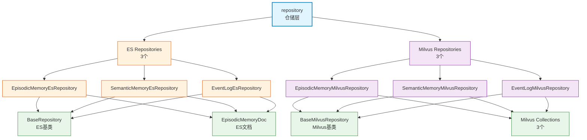

# infra_layer.adapters.out.search.repository

搜索仓储层，提供 6 个记忆搜索仓储（3个ES + 3个Milvus），封装 BM25 文本检索和向量相似度检索逻辑，支持 DI 注入。

## 模块位置

**源码路径**: `src/infra_layer/adapters/out/search/repository/`
**文档路径**: `specs/ac_mod/infra_layer.adapters.out.search.repository.ac.mod.md`
**模块类型**: 包模块

## 目录结构

```
src/infra_layer/adapters/out/search/repository/
├── __init__.py                               # 导出6个仓储
├── episodic_memory_es_repository.py          # 情景记忆 ES 仓储（✅ primary）
├── episodic_memory_milvus_repository.py      # 情景记忆 Milvus 仓储
├── semantic_memory_es_repository.py          # 语义记忆 ES 仓储（✅ primary）
├── semantic_memory_milvus_repository.py      # 语义记忆 Milvus 仓储
├── event_log_es_repository.py                # 事件日志 ES 仓储（✅ primary）
└── event_log_milvus_repository.py            # 事件日志 Milvus 仓储
```

## 快速开始

### ES 文本检索

```python
from infra_layer.adapters.out.search.repository import EpisodicMemoryEsRepository

# 初始化仓储
repo = EpisodicMemoryEsRepository()

# BM25 多词搜索
results = await repo.multi_search(
    query=["Python", "async", "编程"],
    user_id="user123",
    size=10
)

for hit in results:
    print(f"Score: {hit['_score']}, Episode: {hit['_source']['episode']}")
```

### Milvus 向量检索

```python
from infra_layer.adapters.out.search.repository import EpisodicMemoryMilvusRepository

# 初始化仓储
repo = EpisodicMemoryMilvusRepository()

# 向量相似度搜索
query_vector = [0.1] * 1024  # 从 embedding 模型获取

results = await repo.vector_search(
    query_vector=query_vector,
    user_id="user123",
    limit=10
)

for entity in results:
    print(f"Distance: {entity['distance']}, Episode: {entity['episode']}")
```

### DI 注入使用

```python
from core.di.container import Container

# 通过 DI 获取仓储（自动注入）
episodic_repo = Container.get("episodic_memory_es_repository")  # 获取 primary
semantic_repo = Container.get("semantic_memory_es_repository")
```

## 核心组件详解

### 1. 六个仓储类

| 仓储类 | 引擎 | 记忆类型 | primary | DI Key |
|--------|------|----------|---------|--------|
| **EpisodicMemoryEsRepository** | ES | 情景记忆 | ✅ | episodic_memory_es_repository |
| **EpisodicMemoryMilvusRepository** | Milvus | 情景记忆 | ❌ | episodic_memory_milvus_repository |
| **SemanticMemoryEsRepository** | ES | 语义记忆 | ✅ | semantic_memory_es_repository |
| **SemanticMemoryMilvusRepository** | Milvus | 语义记忆 | ❌ | semantic_memory_milvus_repository |
| **EventLogEsRepository** | ES | 事件日志 | ✅ | event_log_es_repository |
| **EventLogMilvusRepository** | Milvus | 事件日志 | ❌ | event_log_milvus_repository |

**primary 说明**：
- `primary=True`: DI 默认注入的实现
- `primary=False`: 需要显式指定 key 才能获取

### 2. ES Repository 核心方法

**共同方法**（所有 ES Repository）:
| 方法 | 功能 | 参数 |
|------|------|------|
| `multi_search()` | BM25多词搜索 | query, user_id, group_id, keywords, date_range, size, from_, explain |
| `create_and_save_*()` | 创建并保存文档 | event_id, user_id, timestamp, episode, search_content, ... |
| `delete_by_*()` | 删除文档 | event_id 或过滤条件 |

**类型特定方法**:
- `EpisodicMemoryEsRepository.get_by_user_and_timerange()`: 按时间范围获取
- `SemanticMemoryEsRepository.multi_search()`: 自动过滤 type=semantic_memory，支持 current_time 有效期过滤
- `EventLogEsRepository.multi_search()`: 自动过滤 type=event_log

### 3. Milvus Repository 核心方法

**共同方法**（所有 Milvus Repository）:
| 方法 | 功能 | 参数 |
|------|------|------|
| `vector_search()` | 向量相似度搜索 | query_vector, user_id, group_id, start_time, end_time, limit, score_threshold |
| `create_and_save_*()` | 创建并保存实体 | event_id, user_id, timestamp, episode, search_content, vector, ... |
| `delete_by_id()` | 按ID删除 | entity_id |

**HNSW 检索参数**:
```python
param={
    "metric_type": "COSINE",
    "params": {"ef": 100}  # 搜索宽度
}
```

### 4. 过滤条件支持

**ES 过滤**:
- `user_id`: 用户过滤（支持空字符串=群组记忆）
- `group_id`: 群组过滤
- `event_type`: 事件类型过滤
- `keywords`: 关键词过滤
- `date_range`: 时间范围 `{"gte": "2024-01-01", "lte": "2024-12-31"}`
- `participant_user_id`: 参与者过滤

**Milvus 过滤**:
- `user_id`: 用户过滤
- `group_id`: 群组过滤
- `event_type`: 事件类型过滤
- `start_time/end_time`: 时间范围（datetime → timestamp）
- `participant_user_id`: 参与者过滤

### 5. 特殊功能

**SmartTextParser**（ES Repository）:
```python
# 计算查询词智能分数（中日韩字符、英文单词权重）
word_score = self._text_parser.calculate_total_score(tokens)

# 按分数排序，保留 Top 10 查询词
sorted_query = sorted(query_with_scores, key=lambda x: x[1], reverse=True)[:10]
```

**Explain 模式**（ES Repository）:
```python
# 启用详细得分解释
results = await repo.multi_search(
    query=["Python"],
    user_id="user123",
    explain=True  # 输出 Elasticsearch 得分计算过程
)
```

## Mermaid 依赖图



## 依赖关系说明

### 对其他模块的依赖
- `specs/ac_mod/core.oxm.es.base_repository.ac.mod.md` - BaseRepository
- `specs/ac_mod/core.oxm.milvus.base_repository.ac.mod.md` - BaseMilvusRepository
- `specs/ac_mod/infra_layer.adapters.out.search.elasticsearch.memory.ac.mod.md` - EpisodicMemoryDoc
- `specs/ac_mod/infra_layer.adapters.out.search.milvus.memory.ac.mod.md` - Milvus Collections
- `specs/ac_mod/core.di.ac.mod.md` - @repository 装饰器
- `specs/ac_mod/common_utils.ac.mod.md` - SmartTextParser、datetime_utils

### 被依赖关系
- `specs/ac_mod/biz_layer.mem_memorize.ac.mod.md` - 记忆化业务层
- `specs/ac_mod/biz_layer.personal_memory_sync.ac.mod.md` - 个人记忆同步
- `specs/ac_mod/agentic_layer.memory_manager.ac.mod.md` - 记忆管理器

## Grep 验证

```bash
# 验证 Repository 类定义
grep "class.*Repository" src/infra_layer/adapters/out/search/repository/*.py

# 验证 @repository 装饰器
grep "@repository" src/infra_layer/adapters/out/search/repository/*.py

# 验证 primary 标记
grep "primary=" src/infra_layer/adapters/out/search/repository/*.py

# 验证 multi_search 方法
grep -A 5 "async def multi_search" src/infra_layer/adapters/out/search/repository/*es*.py

# 验证 vector_search 方法
grep -A 5 "async def vector_search" src/infra_layer/adapters/out/search/repository/*milvus*.py

# 验证导出
grep "__all__" src/infra_layer/adapters/out/search/repository/__init__.py
```

## 可运行示例

### ES 多词搜索

```python
import asyncio
from infra_layer.adapters.out.search.repository import EpisodicMemoryEsRepository

async def test_es_search():
    repo = EpisodicMemoryEsRepository()

    # 多词 BM25 搜索
    results = await repo.multi_search(
        query=["Python", "async", "编程"],
        user_id="user123",
        event_type="conversation",
        size=10
    )

    for hit in results:
        print(f"Score: {hit['_score']:.4f}")
        print(f"Episode: {hit['_source']['episode'][:100]}...")
        print(f"Search Content: {hit['_source']['search_content'][:5]}")
        print("---")

asyncio.run(test_es_search())
```

### Milvus 向量检索

```python
import asyncio
from infra_layer.adapters.out.search.repository import EpisodicMemoryMilvusRepository
from datetime import datetime

async def test_milvus_search():
    repo = EpisodicMemoryMilvusRepository()

    # 模拟查询向量（实际应从 embedding 模型获取）
    query_vector = [0.1] * 1024

    # 向量相似度搜索
    results = await repo.vector_search(
        query_vector=query_vector,
        user_id="user123",
        start_time=datetime(2024, 1, 1),
        end_time=datetime(2024, 12, 31),
        limit=10,
        score_threshold=0.7
    )

    for entity in results:
        print(f"ID: {entity['id']}")
        print(f"Distance: {entity['distance']:.4f}")
        print(f"Episode: {entity['episode'][:100]}...")
        print("---")

asyncio.run(test_milvus_search())
```

### 语义记忆有效期过滤

```python
import asyncio
from datetime import datetime
from infra_layer.adapters.out.search.repository import SemanticMemoryEsRepository

async def test_semantic_search():
    repo = SemanticMemoryEsRepository()

    # 按当前时间过滤有效期
    results = await repo.multi_search(
        query=["Python", "编程"],
        user_id="user123",
        current_time=datetime.now(),  # 过滤 start_time <= now <= end_time
        size=10
    )

    for hit in results:
        source = hit['_source']
        extend = source.get('extend', {})
        print(f"Content: {source['episode']}")
        print(f"Start: {extend.get('start_time')}")
        print(f"End: {extend.get('end_time')}")
        print("---")

asyncio.run(test_semantic_search())
```

### DI 注入使用

```python
from core.di.container import Container

# 获取 primary 仓储（ES）
episodic_repo = Container.get("episodic_memory_es_repository")
semantic_repo = Container.get("semantic_memory_es_repository")
event_repo = Container.get("event_log_es_repository")

# 获取 Milvus 仓储（需指定完整 key）
episodic_milvus = Container.get("episodic_memory_milvus_repository")
semantic_milvus = Container.get("semantic_memory_milvus_repository")
event_milvus = Container.get("event_log_milvus_repository")

# 使用仓储
results = await episodic_repo.multi_search(query=["Python"], user_id="user123")
```

## 测试命令

```bash
# 测试所有 Repository
pytest src/infra_layer/adapters/out/search/repository/test_*.py -v

# 测试 ES Repository
pytest src/infra_layer/adapters/out/search/repository/test_*es*.py -v

# 测试 Milvus Repository
pytest src/infra_layer/adapters/out/search/repository/test_*milvus*.py -v

# 验证导入
python -c "from infra_layer.adapters.out.search.repository import EpisodicMemoryEsRepository, EpisodicMemoryMilvusRepository; print('OK')"

# 验证 DI 注册
python -c "
from core.di.container import Container
repo = Container.get('episodic_memory_es_repository')
print(f'Repository: {repo.__class__.__name__}')
"
```
