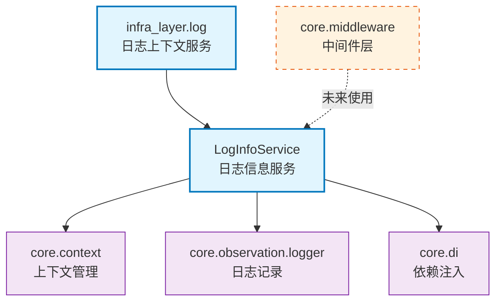

# infra_layer.log

日志上下文信息注入服务，提供异步上下文管理器支持 trace_id、group_id、user_id 的管理。

## 模块位置

| 项目 | 路径 |
|------|------|
| 源码 | `src/infra_layer/log/` |
| 文档 | `specs/ac_mod/infra_layer.log.ac.mod.md` |
| 类型 | 包模块 |

## 目录结构

```
src/infra_layer/log/
├── __init__.py                 # 包初始化
└── log_info_service.py         # 日志信息服务实现
```

## 快速开始

### 基本使用

```python
from infra_layer.log.log_info_service import log_context, get_current_trace_id

# 1. 使用上下文管理器注入日志信息
async with log_context(trace_id="req_123", group_id="group_1", from_user_id="user_1"):
    # 业务代码
    current_trace = get_current_trace_id()
    print(f"当前 trace_id: {current_trace}")

# 2. 使用 DI 获取服务
from core.di import get_bean_by_type
from infra_layer.log.log_info_service import LogInfoService

log_service = get_bean_by_type(LogInfoService)
async with log_service.inject_log_info(trace_id="req_456"):
    await some_async_operation()

# 3. 读取当前上下文信息
from infra_layer.log.log_info_service import (
    get_current_trace_id,
    get_current_group_id,
    get_current_from_user_id
)

trace_id = get_current_trace_id()
group_id = get_current_group_id()
user_id = get_current_from_user_id()
```

## 核心组件详解

### 1. LogInfoService

**功能**: DI 单例服务，管理日志上下文信息的注入和读取

**DI 注册**: `@component(name="log_info_service")`

**主要方法**:

| 方法 | 参数 | 返回 | 说明 |
|------|------|------|------|
| `inject_log_info` | `trace_id`, `group_id`, `from_user_id` | `AsyncContextManager` | 注入日志信息到上下文 |
| `override_trace_id` | `trace_id: str` | `AsyncContextManager` | 临时覆盖 trace_id |
| `override_group_id` | `group_id: str` | `AsyncContextManager` | 临时覆盖 group_id |
| `override_from_user_id` | `from_user_id: str` | `AsyncContextManager` | 临时覆盖 from_user_id |
| `get_current_trace_id` | - | `Optional[str]` | 获取当前 trace_id |
| `get_current_group_id` | - | `Optional[str]` | 获取当前 group_id |
| `get_current_from_user_id` | - | `Optional[str]` | 获取当前 from_user_id |

**示例**:
```python
from core.di import get_bean_by_type
from infra_layer.log.log_info_service import LogInfoService

log_service = get_bean_by_type(LogInfoService)

# 完整注入
async with log_service.inject_log_info(
    trace_id="req_001",
    group_id="group_001",
    from_user_id="user_001"
) as app_info:
    print(app_info)  # {'trace_id': 'req_001', 'group_id': 'group_001', 'from_user_id': 'user_001'}

# 临时覆盖
async with log_service.override_trace_id("req_002"):
    trace = LogInfoService.get_current_trace_id()
    print(trace)  # req_002
```

### 2. 便捷函数

**log_context()**

统一的日志上下文管理器，推荐使用：
```python
from infra_layer.log.log_info_service import log_context

async with log_context(trace_id="req_123", group_id="grp_1"):
    await process_request()
```

**get_log_service()**

获取全局日志服务实例（带缓存）：
```python
from infra_layer.log.log_info_service import get_log_service

service = get_log_service()
async with service.inject_log_info(trace_id="req_456"):
    pass
```

**导出的读取函数**:
```python
from infra_layer.log.log_info_service import (
    get_current_trace_id,
    get_current_group_id,
    get_current_from_user_id
)

# 等价于 LogInfoService.get_current_trace_id()
trace_id = get_current_trace_id()
```

## 实现原理

### 上下文管理机制

日志信息存储在 `core.context` 的 `app_info` 字典中：

```python
# 注入流程
current_app_info = context.get_current_app_info() or {}
app_info = current_app_info.copy()
app_info.update({'trace_id': trace_id, ...})
token = context.set_current_app_info(app_info)

# 清理流程（自动执行）
context.clear_current_app_info(token)
```

**特性**:
- 使用 ContextVar 实现异步隔离
- 每次注入创建新副本，保证不可变性
- 使用 token 机制恢复原始状态
- 自动处理异常情况

## Mermaid 依赖图



## 依赖关系说明

### 对其他模块的依赖

| 模块 | 用途 | 引用 |
|------|------|------|
| `specs/ac_mod/core.context.ac.mod.md` | 上下文管理 | `context.get_current_app_info()`, `context.set_current_app_info()` |
| `specs/ac_mod/core.observation.tracing.ac.mod.md` | 日志记录器 | `get_logger(__name__)` |
| `specs/ac_mod/core.di.ac.mod.md` | 依赖注入 | `@component`, `get_bean_by_type` |

**验证代码**:
```bash
# 检查 core.context 依赖
grep -n "from core.context" src/infra_layer/log/log_info_service.py

# 检查 core.observation 依赖
grep -n "from core.observation.logger" src/infra_layer/log/log_info_service.py

# 检查 core.di 依赖
grep -n "from core.di" src/infra_layer/log/log_info_service.py
```

### 被依赖关系

**当前状态**: 该模块为新模块，暂无其他模块使用

**预期使用场景**:
- API 中间件（注入请求级别的 trace_id）
- 消息队列消费者（注入消息级别的 group_id）
- 异步任务（注入任务级别的上下文）
- 分布式追踪（关联微服务调用链路）

**验证代码**:
```bash
# 查找使用
grep -r "from infra_layer.log" src/ --include="*.py"
grep -r "LogInfoService" src/ --include="*.py"
grep -r "log_context" src/ --include="*.py"
```

## 可以验证模块可运行的测试命令

```bash
# 设置 PYTHONPATH
export PYTHONPATH=/home/user/EverMemOS/src

# 1. 导入模块
python -c "from infra_layer.log.log_info_service import LogInfoService; print('✅ 导入成功')"

# 2. 测试 DI 注入
python -c "
from core.di import get_bean_by_type
from infra_layer.log.log_info_service import LogInfoService
service = get_bean_by_type(LogInfoService)
print(f'✅ LogInfoService 类型: {type(service).__name__}')
"

# 3. 测试便捷函数
python -c "
from infra_layer.log.log_info_service import (
    log_context,
    get_log_service,
    get_current_trace_id
)
print('✅ 便捷函数导入成功')
"

# 4. 测试上下文管理（异步）
python -c "
import asyncio
from infra_layer.log.log_info_service import log_context, get_current_trace_id

async def test():
    async with log_context(trace_id='test_123', group_id='grp_1'):
        trace = get_current_trace_id()
        print(f'✅ trace_id: {trace}')

asyncio.run(test())
"

# 5. 验证依赖关系
grep -n "from core.context" src/infra_layer/log/log_info_service.py
grep -n "from core.observation.logger" src/infra_layer/log/log_info_service.py
grep -n "from core.di" src/infra_layer/log/log_info_service.py

# 6. 检查模块结构
ls -la src/infra_layer/log/
```

## 使用场景示例

### 场景1: API 请求追踪

```python
from fastapi import Request
from infra_layer.log.log_info_service import log_context
import uuid

async def process_request(request: Request):
    trace_id = request.headers.get("X-Trace-ID", str(uuid.uuid4()))

    async with log_context(trace_id=trace_id):
        # 业务逻辑，所有日志自动关联 trace_id
        result = await handle_business_logic()
        return result
```

### 场景2: 消息队列消费

```python
from infra_layer.log.log_info_service import log_context

async def consume_message(message):
    async with log_context(
        trace_id=message.get("message_id"),
        group_id=message.get("group_id"),
        from_user_id=message.get("from_user_id")
    ):
        await process_message(message)
```

### 场景3: 嵌套上下文

```python
from infra_layer.log.log_info_service import log_context, get_current_trace_id

async def outer_operation():
    async with log_context(trace_id="outer_001", group_id="group_1"):
        print(get_current_trace_id())  # outer_001

        async with log_context(trace_id="inner_002"):
            print(get_current_trace_id())  # inner_002

        print(get_current_trace_id())  # outer_001 (自动恢复)
```

## 注意事项

1. **异步环境**: 必须在 async 函数中使用 `async with`
2. **上下文隔离**: 不同的异步任务有独立的上下文空间
3. **自动恢复**: 退出上下文管理器时自动恢复原始状态
4. **线程安全**: 基于 ContextVar，天然支持异步并发
5. **性能**: 每次注入会复制 app_info 字典，避免大量嵌套
