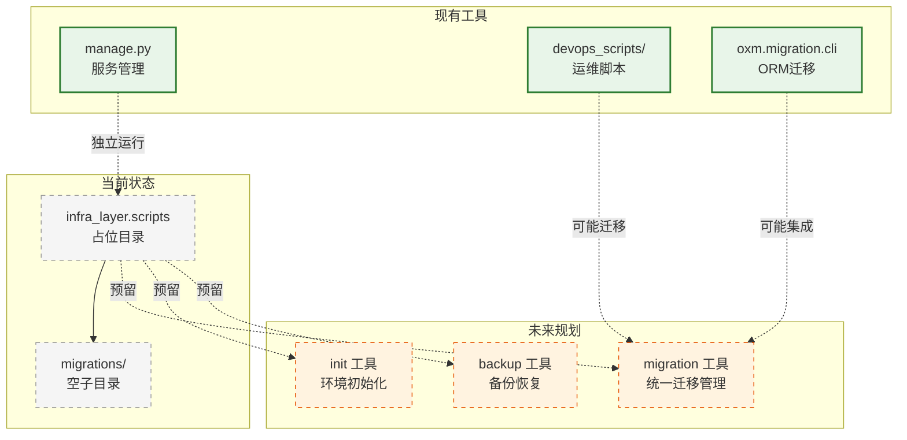

# infra_layer.scripts

脚本工具包（占位），预留用于存放基础设施层的自动化脚本和迁移工具。

## 模块位置

| 项目 | 路径 |
|------|------|
| 源码 | `src/infra_layer/scripts/` |
| 文档 | `specs/ac_mod/infra_layer.scripts.ac.mod.md` |
| 类型 | 包模块 |

## 目录结构

```
src/infra_layer/scripts/
├── __init__.py                 # 包初始化（空）
└── migrations/                 # 数据库迁移脚本（预留）
    └── __init__.py             # 子包初始化（空）
```

**当前状态**: 占位目录，暂无实际脚本

## 快速开始

### 当前实现

该模块为空包，暂无可用功能：
```python
# 可以导入，但没有功能
import infra_layer.scripts
```

### 项目现有脚本工具

项目中的脚本工具分布在其他位置：

**1. 管理脚本**: `src/manage.py`
```bash
# 启动服务
python src/manage.py start

# 启动开发服务器
python src/manage.py dev

# 停止服务
python src/manage.py stop

# 检查配置
python src/manage.py check_env_file

# 运行迁移
python src/manage.py migrate_mongo
python src/manage.py migrate_postgres
```

**2. DevOps 脚本**: `src/devops_scripts/`
- `mongo_migrate.py` - MongoDB 迁移工具
- `data_fix/` - 数据修复脚本
  - `es_rebuild_index.py` - ES 索引重建
  - `es_sync_docs.py` - ES 文档同步
  - `milvus_rebuild_collection.py` - Milvus 集合重建
  - `milvus_sync_docs.py` - Milvus 文档同步
  - `mongo_add_timestamp_shard.py` - Mongo 时间戳分片
  - `mongo_fix_episodic_memory_missing_vector.py` - 修复缺失向量

**3. ORM 迁移 CLI**: `src/core/oxm/mongo/migration/cli.py`
```bash
# MongoDB 迁移命令
python -m core.oxm.mongo.migration.cli
```

## 核心组件详解

### 1. 模块规划

**预期功能**:
- 数据库迁移脚本管理
- 基础设施初始化脚本
- 数据修复和清理工具
- 自动化运维脚本

**目录规划**:
```
infra_layer/scripts/
├── migrations/              # 数据库迁移
│   ├── mongo/              # MongoDB 迁移
│   ├── postgres/           # PostgreSQL 迁移
│   └── es/                 # Elasticsearch 迁移
├── init/                   # 初始化脚本
├── backup/                 # 备份恢复
└── health_check/           # 健康检查
```

### 2. 与现有工具的关系

| 工具 | 位置 | 功能 | 迁移规划 |
|------|------|------|----------|
| `manage.py` | `src/manage.py` | 服务管理、环境检查 | 保持独立 |
| `devops_scripts/` | `src/devops_scripts/` | 数据修复、运维工具 | 可能迁移部分功能 |
| `oxm.migration.cli` | `src/core/oxm/mongo/migration/cli.py` | ORM 迁移命令 | 可集成到此 |

## Mermaid 依赖图



## 依赖关系说明

### 对其他模块的依赖

**当前**: 无（空包）

**未来规划**:
- `specs/ac_mod/core.di.ac.mod.md` - 依赖注入（脚本工具注册）
- `specs/ac_mod/core.oxm.ac.mod.md` - ORM 框架（数据库迁移）
- `specs/ac_mod/core.config.ac.mod.md` - 配置管理（环境配置）

### 被依赖关系

**当前**: 无（空包）

**验证代码**:
```bash
# 查找使用（预期无结果）
grep -r "from infra_layer.scripts" src/ --include="*.py"
grep -r "import infra_layer.scripts" src/ --include="*.py"
```

## 可以验证模块可运行的测试命令

```bash
# 设置 PYTHONPATH
export PYTHONPATH=/home/user/EverMemOS/src

# 1. 导入空包（不报错）
python -c "import infra_layer.scripts; print('✅ 空包导入成功')"

# 2. 导入 migrations 子包
python -c "import infra_layer.scripts.migrations; print('✅ migrations 子包导入成功')"

# 3. 检查目录结构
ls -la src/infra_layer/scripts/
ls -la src/infra_layer/scripts/migrations/

# 4. 验证无依赖关系
grep -r "from infra_layer.scripts" src/ --include="*.py"
grep -r "import infra_layer.scripts" src/ --include="*.py"

# 5. 查看现有脚本工具
ls -la src/manage.py
ls -la src/devops_scripts/
python src/core/oxm/mongo/migration/cli.py --help 2>/dev/null || echo "需要参数"
```

## 现有脚本使用示例

### 1. manage.py 服务管理

```bash
# 启动服务（前台）
python src/manage.py start

# 启动开发服务器（热加载）
python src/manage.py dev

# 停止服务
python src/manage.py stop

# 检查环境配置
python src/manage.py check_env_file

# 运行数据库迁移
python src/manage.py migrate_mongo
python src/manage.py migrate_postgres
```

### 2. DevOps 数据修复脚本

```bash
# ES 索引重建
python src/devops_scripts/data_fix/es_rebuild_index.py

# Milvus 集合重建
python src/devops_scripts/data_fix/milvus_rebuild_collection.py

# MongoDB 迁移
python src/devops_scripts/mongo_migrate.py
```

### 3. ORM 迁移命令

```bash
# MongoDB 迁移 CLI
python -m core.oxm.mongo.migration.cli create <migration_name>
python -m core.oxm.mongo.migration.cli migrate
python -m core.oxm.mongo.migration.cli rollback
```

## 未来规划

### 预期架构

**统一脚本管理**:
```python
# 未来的使用方式
from infra_layer.scripts.migrations import MigrationManager
from infra_layer.scripts.init import setup_environment
from infra_layer.scripts.backup import BackupService

# 迁移管理
manager = MigrationManager()
manager.migrate("mongo", version="latest")
manager.migrate("postgres", version="001")

# 环境初始化
setup_environment(
    create_indexes=True,
    seed_data=True
)

# 备份恢复
backup = BackupService()
backup.create_backup("full")
backup.restore_from_backup("backup_20241116.tar.gz")
```

**CLI 接口**:
```bash
# 统一 CLI（未来）
python -m infra_layer.scripts migrate --db mongo --version latest
python -m infra_layer.scripts init --env production
python -m infra_layer.scripts backup --type full
```

### 迁移路径

**第一阶段**: 整合现有迁移工具
- 集成 `core.oxm.mongo.migration.cli`
- 提供统一的迁移接口

**第二阶段**: 添加初始化脚本
- 数据库初始化（索引、分片）
- 配置文件生成
- 健康检查

**第三阶段**: 完善运维工具
- 数据备份恢复
- 数据修复工具
- 性能诊断

## 注意事项

1. **当前为空包**: 该模块暂无实际功能，仅作为占位符
2. **使用现有工具**: 当前应使用 `manage.py` 和 `devops_scripts/`
3. **未来整合**: 该模块预期整合分散的脚本工具
4. **命名约定**: 脚本应遵循 `verb_noun.py` 命名模式（如 `migrate_mongo.py`）
5. **文档先行**: 新增脚本时应更新本文档
