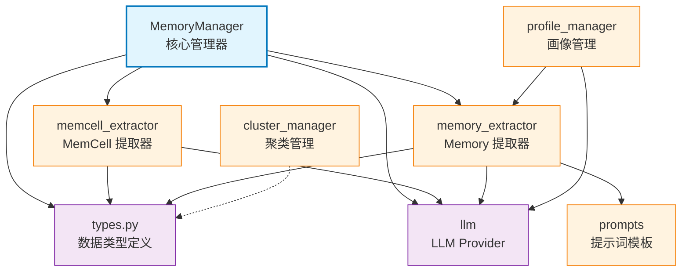

# memory_layer

记忆管理核心层，提供 MemCell 提取、Memory 生成、LLM 集成等记忆处理功能

## 模块位置

**源码路径**: `src/memory_layer/`
**文档路径**: `specs/ac_mod/memory_layer.ac.mod.md`
**模块类型**: 包模块

## 目录结构

```
src/memory_layer/
├── __init__.py                 # 包初始化，导出核心类型和 LLM Provider
├── memory_manager.py           # MemoryManager 核心管理器
├── types.py                    # 核心数据类型定义（MemCell, Memory, MemoryType 等）
├── cluster_manager/            # 聚类管理器（向量聚类、Storage 接口）
├── profile_manager/            # 画像管理器（Discriminator、Storage 接口）
├── llm/                        # LLM 集成（protocol、provider）
├── memcell_extractor/          # MemCell 提取器
├── memory_extractor/           # Memory 提取器
│   ├── group_profile/          # 群组画像提取（4 个文件）
│   └── profile_memory/         # 个人画像提取（11 个文件）
└── prompts/                    # 提示词模板
    ├── en/                     # 英文提示词（11 个文件）
    ├── zh/                     # 中文提示词（11 个文件）
    └── eval/                   # 评估提示词（6 个文件）
```

## 快速开始

### 基本使用

```python
from memory_layer import (
    LLMProvider, OpenAIProvider,
    create_provider, create_provider_from_env,
    MemoryType, RawDataType
)
from memory_layer.memory_manager import MemoryManager, MemorizeRequest
from memory_layer.types import MemCell, Memory
from memory_layer.memcell_extractor.base_memcell_extractor import RawData

# 1. 初始化 MemoryManager（从环境变量读取配置）
manager = MemoryManager()

# 2. 准备原始数据
history_raw_data = [
    RawData(
        user_id="user1",
        timestamp=datetime.now() - timedelta(hours=1),
        content="Hello, how are you?",
        extend={"message_id": "msg1"}
    )
]
new_raw_data = [
    RawData(
        user_id="user2",
        timestamp=datetime.now(),
        content="I'm good, thanks!",
        extend={"message_id": "msg2"}
    )
]

# 3. 提取 MemCell（带语义记忆和事件日志）
memcell, status = await manager.extract_memcell(
    history_raw_data_list=history_raw_data,
    new_raw_data_list=new_raw_data,
    raw_data_type=RawDataType.CONVERSATION,
    group_id="group1",
    user_id_list=["user1", "user2"],
    enable_semantic_extraction=True,
    enable_event_log_extraction=True
)

# 4. 提取 Memory
memory_list = await manager.extract_memory(
    memcell_list=[memcell],
    memory_type=MemoryType.EPISODE_SUMMARY,
    user_ids=["user1", "user2"],
    group_id="group1"
)
```

### 子模块说明

- **llm**: LLM Provider 协议和实现（OpenAI）
- **cluster_manager**: MemCell 向量聚类管理
- **profile_manager**: 用户画像自动提取与管理
- **memcell_extractor**: 从原始数据提取 MemCell
- **memory_extractor**: 从 MemCell 提取 Memory（Episode/Profile/GroupProfile/Semantic/EventLog）
- **prompts**: 多语言提示词模板（通过 `MEMORY_LANGUAGE` 环境变量切换）

### 配置管理

通过环境变量配置 LLM（详见 `env.template`）：

| 环境变量 | 说明 | 默认值 |
|---------|------|--------|
| `LLM_PROVIDER` | LLM 提供商 | `openai` |
| `LLM_MODEL` | 模型名称 | `Qwen3-235B` |
| `LLM_BASE_URL` | API 基础 URL | - |
| `LLM_API_KEY` | API 密钥 | `123` |
| `LLM_TEMPERATURE` | 温度参数 | `0.3` |
| `LLM_MAX_TOKENS` | 最大 Token 数 | `16384` |
| `MEMORY_LANGUAGE` | 提示词语言 | `en` (支持 `zh`) |

## 核心组件详解

### 1. MemoryManager 主类

**核心功能**：
- **MemCell 提取**：从原始数据提取 MemCell（带可选的语义记忆、事件日志）
- **Memory 提取**：支持 Episode、Profile、GroupProfile、Semantic、EventLog 多种类型
- **LLM 管理**：内部管理多个 LLMProvider 实例（对话、Episode、Profile、EventLog 分离）

**主要方法**：
- `extract_memcell()`: 提取 MemCell，参数控制是否提取语义记忆和事件日志
- `extract_memory()`: 根据 `memory_type` 提取不同类型的记忆

### 2. 核心数据类型（types.py）

**MemoryType 枚举**：
- `EPISODE_SUMMARY`: 情节记忆
- `PROFILE`: 能力与经验画像
- `GROUP_PROFILE`: 群组画像
- `SEMANTIC_SUMMARY`: 语义记忆
- `EVENT_LOG`: 事件日志

**RawDataType 枚举**：
- `CONVERSATION`: 对话数据

**MemCell 数据类**：
```python
@dataclass
class MemCell:
    event_id: str
    user_id_list: List[str]
    original_data: List[Dict[str, Any]]
    timestamp: datetime.datetime
    summary: str
    group_id: Optional[str] = None
    episode: Optional[str] = None
    semantic_memories: Optional[List[SemanticMemoryItem]] = None
    event_log: Optional[Any] = None
    # ... 更多字段
```

**Memory 数据类**：
```python
@dataclass
class Memory:
    memory_type: MemoryType
    user_id: str
    timestamp: datetime.datetime
    ori_event_id_list: List[str]
    subject: Optional[str] = None
    summary: Optional[str] = None
    episode: Optional[str] = None
    # ... 更多字段
```

### 3. 架构设计

**分层架构**：
```
MemoryManager (管理器)
    ├── LLMProvider (LLM 抽象层)
    ├── MemCellExtractor (MemCell 提取)
    │   ├── ConvMemCellExtractor
    │   └── SemanticMemoryExtractor (可选)
    └── MemoryExtractor (Memory 提取)
        ├── EpisodeMemoryExtractor
        ├── ProfileMemoryExtractor
        ├── GroupProfileMemoryExtractor
        ├── SemanticMemoryExtractor
        └── EventLogExtractor
```

**工作流程**：
1. **MemCell 提取**：`RawData → MemCell`（含 summary, episode, semantic_memories, event_log）
2. **Memory 提取**：`MemCell[] → Memory[]`（按类型聚合、分析、生成记忆）

## Mermaid 依赖图



## 依赖关系说明

### 对其他模块的依赖

通过 Grep 验证：
```bash
grep -rn "^from core\|^from common_utils" src/memory_layer/
```

**结果**：
- `core.observation.logger`: 日志记录
- `common_utils.datetime_utils`: 时间格式化

**外部依赖**：
- `agentic_layer.vectorize_service`: 向量化服务（可选，ClusterManager 使用）

### 被依赖关系

通过 Grep 验证：
```bash
grep -rn "^from memory_layer\|^import memory_layer" src/
```

**结果**：
- `src/biz_layer/mem_db_operations.py`: 使用 `MemoryManager`, `MemCell`, `Memory`, `RawDataType`
- `src/biz_layer/mem_memorize.py`: 使用 `MemoryManager`, `MemorizeRequest`, `MemoryType`
- `src/agentic_layer/memory_manager.py`: 使用 `Memory`, `MemorizeRequest`
- `src/agentic_layer/schemas.py`: 使用 `MemorizeRequest`

**文档引用**：
- `specs/ac_mod/biz_layer.mem_db_operations.ac.mod.md` (待创建)
- `specs/ac_mod/biz_layer.mem_memorize.ac.mod.md` (待创建)
- `specs/ac_mod/agentic_layer.memory_manager.ac.mod.md` (待创建)

## 可运行的测试命令

```bash
# 1. 验证模块导入
python -c "from memory_layer import LLMProvider, MemoryType, RawDataType; print('✅ Import OK')"

# 2. 验证 MemoryManager 实例化
python -c "from memory_layer.memory_manager import MemoryManager; m = MemoryManager(); print('✅ MemoryManager OK')"

# 3. 验证数据类型
python -c "from memory_layer.types import MemoryType; print([e.value for e in MemoryType])"

# 4. 验证 LLM Provider
python -c "from memory_layer import create_provider; p = create_provider('openai', api_key='test', base_url='http://localhost'); print('✅ LLM Provider OK')"

# 5. 运行完整测试（如果存在）
pytest src/memory_layer/tests/ -v

# 6. 检查环境变量配置
python -c "import os; print('LLM_PROVIDER:', os.getenv('LLM_PROVIDER', 'openai')); print('MEMORY_LANGUAGE:', os.getenv('MEMORY_LANGUAGE', 'en'))"
```

## 示例场景

### 场景 1: 对话记忆提取

```python
from memory_layer.memory_manager import MemoryManager
from memory_layer.types import RawDataType, MemoryType
from memory_layer.memcell_extractor.base_memcell_extractor import RawData
import datetime

manager = MemoryManager()

# 准备对话数据
messages = [
    RawData(
        user_id="alice",
        timestamp=datetime.datetime.now(),
        content="我最近在学习 Python",
        extend={"platform": "WeChat"}
    ),
    RawData(
        user_id="bob",
        timestamp=datetime.datetime.now(),
        content="太好了！有什么需要帮忙的吗？",
        extend={"platform": "WeChat"}
    )
]

# 提取 MemCell
memcell, status = await manager.extract_memcell(
    history_raw_data_list=[],
    new_raw_data_list=messages,
    raw_data_type=RawDataType.CONVERSATION,
    user_id_list=["alice", "bob"],
    enable_semantic_extraction=True
)

# 提取 Profile Memory
profiles = await manager.extract_memory(
    memcell_list=[memcell],
    memory_type=MemoryType.PROFILE,
    user_ids=["alice"],
    group_id="private_chat"
)

print(f"提取到 {len(profiles)} 个用户画像")
```

### 场景 2: 多语言提示词切换

```bash
# 使用中文提示词
export MEMORY_LANGUAGE=zh
python your_script.py

# 使用英文提示词（默认）
export MEMORY_LANGUAGE=en
python your_script.py
```

## 扩展阅读

- **子模块文档**：
  - `specs/ac_mod/memory_layer.llm.ac.mod.md`
  - `specs/ac_mod/memory_layer.cluster_manager.ac.mod.md`
  - `specs/ac_mod/memory_layer.profile_manager.ac.mod.md`
  - `specs/ac_mod/memory_layer.prompts.ac.mod.md`
- **API 设计**：参考 `src/memory_layer/__init__.py` 导出的公共接口
- **提示词工程**：参考 `src/memory_layer/prompts/` 目录下的模板
