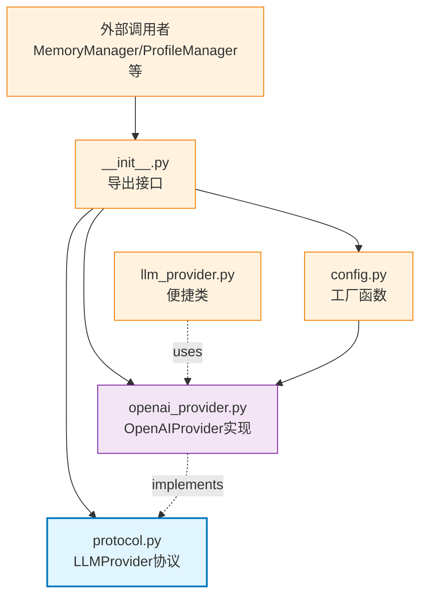

# memory_layer.llm

LLM Provider 协议和实现，提供统一的 LLM 调用接口（目前支持 OpenAI/OpenRouter）

## 模块位置

**源码路径**: `src/memory_layer/llm/`
**文档路径**: `specs/ac_mod/memory_layer.llm.ac.mod.md`
**模块类型**: 包模块

## 目录结构

```
src/memory_layer/llm/
├── __init__.py                 # 导出 LLMProvider, OpenAIProvider, 工厂函数
├── protocol.py                 # LLMProvider 协议定义（抽象接口）
├── openai_provider.py          # OpenAIProvider 实现（支持 OpenRouter）
├── config.py                   # 配置工具函数（create_provider, create_cheap_provider）
└── llm_provider.py             # LLMProvider 便捷类（非抽象实现）
```

## 快速开始

### 基本使用

```python
from memory_layer.llm import (
    LLMProvider,
    OpenAIProvider,
    create_provider,
    create_provider_from_env
)

# 方式 1: 直接创建 OpenAIProvider
provider = OpenAIProvider(
    model="gpt-4o-mini",
    api_key="your-api-key",
    base_url="https://openrouter.ai/api/v1",
    temperature=0.3,
    max_tokens=2048
)

# 方式 2: 使用工厂函数
provider = create_provider(
    provider_type="openai",  # 目前仅支持 "openai"
    model="gpt-4o",
    api_key="your-api-key",
    temperature=0.7
)

# 方式 3: 从环境变量创建（推荐）
provider = create_provider_from_env("openai")

# 生成响应
response = await provider.generate(
    prompt="Explain memory management",
    temperature=0.5,  # 可选覆盖
    max_tokens=1024   # 可选覆盖
)

print(response)
```

### 环境变量配置

```bash
# 设置环境变量（参考 env.template）
export OPENROUTER_API_KEY="sk-or-v1-xxx"
export LLM_MODEL="gpt-4o-mini"
export LLM_TEMPERATURE="0.3"
export LLM_MAX_TOKENS="4096"
export LLM_OPENROUTER_PROVIDER="openai/gpt-4o-mini"  # 指定 OpenRouter 提供商（可选）

# 使用环境变量
python -c "
from memory_layer.llm import create_provider_from_env
provider = create_provider_from_env('openai')
print(provider)
"
```

### 测试连接

```python
# 测试 LLM 连接
provider = OpenAIProvider(api_key="your-key")
is_ok = await provider.test_connection()

if is_ok:
    print("✅ Connection OK")
else:
    print("❌ Connection Failed")
```

## 核心组件详解

### 1. LLMProvider 协议（protocol.py）

**定义**：
```python
class LLMProvider(Protocol):
    async def generate(
        self,
        prompt: str,
        temperature: float | None = None,
        extra_body: dict | None = None,
        response_format: dict | None = None,
    ) -> str:
        """生成响应"""
        ...

    async def test_connection(self) -> bool:
        """测试连接"""
        ...

    def __repr__(self) -> str:
        """字符串表示"""
        ...
```

**作用**：
- 定义 LLM Provider 的统一接口
- 所有具体实现必须遵循此协议
- 支持类型检查（mypy/pyright）

### 2. OpenAIProvider 实现

**初始化参数**：

| 参数 | 类型 | 默认值 | 说明 |
|------|------|--------|------|
| `model` | str | `gpt-4.1-mini` | 模型名称 |
| `api_key` | str | `OPENROUTER_API_KEY` env | API 密钥 |
| `base_url` | str | `https://openrouter.ai/api/v1` | OpenRouter API 端点 |
| `temperature` | float | 0.3 | 采样温度（0.0-2.0） |
| `max_tokens` | int | 102400 | 最大生成 Token 数 |
| `enable_stats` | bool | False | 启用统计信息收集 |

**主要方法**：

| 方法 | 参数 | 返回值 | 说明 |
|------|------|--------|------|
| `generate()` | prompt, temperature(可选), max_tokens(可选), response_format(可选) | str | 生成响应文本 |
| `test_connection()` | - | bool | 测试 API 连接 |
| `from_env()` | **kwargs | OpenAIProvider | 从环境变量创建实例 |

**特性**：
- **自动重试**：HTTP 429 错误自动重试（最多 5 次，指数退避）
- **异步请求**：使用 `aiohttp` 实现异步调用
- **超时控制**：默认 600 秒超时
- **错误处理**：抛出 `LLMError` 异常

**OpenRouter 提供商选择**：
```bash
# 指定特定提供商（避免回退）
export LLM_OPENROUTER_PROVIDER="openai/gpt-4o-mini,anthropic/claude-3-sonnet"
# → 优先使用 openai，失败时使用 anthropic
```

### 3. 工厂函数

**create_provider()**：
```python
def create_provider(provider_type: str, **kwargs) -> LLMProvider:
    """
    工厂函数，根据类型创建 Provider

    Args:
        provider_type: "openai" (目前仅支持)
        **kwargs: 传递给 OpenAIProvider 的参数

    Returns:
        LLMProvider 实例

    Raises:
        ValueError: 不支持的 provider_type
    """
```

**create_provider_from_env()**：
```python
def create_provider_from_env(provider_type: str, **kwargs) -> LLMProvider:
    """
    从环境变量创建 Provider

    读取的环境变量：
    - OPENROUTER_API_KEY
    - LLM_MODEL
    - LLM_TEMPERATURE
    - LLM_MAX_TOKENS
    - LLM_OPENROUTER_PROVIDER (可选)
    """
```

**辅助函数**（config.py）：
```python
from memory_layer.llm.config import (
    create_cheap_provider,      # gpt-4o-mini, temp=0.3, max_tokens=1024
    create_high_quality_provider # gpt-4o, temp=0.7, max_tokens=4096
)
```

### 4. LLMError 异常

```python
class LLMError(Exception):
    """LLM 调用错误"""
    pass

# 使用示例
try:
    response = await provider.generate("Hello")
except LLMError as e:
    logger.error(f"LLM 调用失败: {e}")
```

## Mermaid 依赖图



## 依赖关系说明

### 对其他模块的依赖

通过 Grep 验证：
```bash
grep -rn "^from " src/memory_layer/llm/*.py | grep -v "^from \."
```

**结果**：
- `core.observation.logger`: 日志记录
- `aiohttp`: 异步 HTTP 请求
- 标准库：`os`, `json`, `time`, `asyncio`

**无内部模块依赖**（独立模块）

### 被依赖关系

通过 Grep 验证：
```bash
grep -rn "from memory_layer.llm\|from \.llm" src/memory_layer/
```

**结果**：
- `memory_layer/__init__.py`: 导出到顶层
- `memory_layer/memory_manager.py`: 创建 LLMProvider 实例
- `memory_layer/profile_manager/manager.py`: 使用 LLMProvider
- `memory_layer/memcell_extractor/base_memcell_extractor.py`: 使用 LLMProvider
- 其他所有需要 LLM 的组件

**文档引用**：
- `specs/ac_mod/memory_layer.ac.mod.md`
- `specs/ac_mod/memory_layer.profile_manager.ac.mod.md`
- `specs/ac_mod/memory_layer.cluster_manager.ac.mod.md`

## 可运行的测试命令

```bash
# 1. 验证导入
python -c "from memory_layer.llm import LLMProvider, OpenAIProvider, create_provider; print('✅ Import OK')"

# 2. 验证 OpenAIProvider 创建
python -c "
from memory_layer.llm import OpenAIProvider
provider = OpenAIProvider(model='gpt-4o-mini', api_key='test')
print(f'✅ Provider created: {provider}')
"

# 3. 验证工厂函数
python -c "
from memory_layer.llm import create_provider
provider = create_provider('openai', model='gpt-4o', api_key='test')
print('✅ Factory function OK')
"

# 4. 验证环境变量配置
export OPENROUTER_API_KEY="test-key"
export LLM_MODEL="gpt-4o-mini"
python -c "
from memory_layer.llm import create_provider_from_env
provider = create_provider_from_env('openai')
print(f'✅ Provider from env: model={provider.model}')
"

# 5. 测试连接（需要真实 API Key）
export OPENROUTER_API_KEY="sk-or-v1-xxx"
python -c "
import asyncio
from memory_layer.llm import OpenAIProvider

async def test():
    provider = OpenAIProvider()
    ok = await provider.test_connection()
    print(f'✅ Connection test: {ok}')

asyncio.run(test())
"

# 6. 完整调用测试
python -c "
import asyncio
from memory_layer.llm import OpenAIProvider

async def test():
    provider = OpenAIProvider(model='gpt-4o-mini')
    response = await provider.generate('Say hello', temperature=0.5)
    print(f'✅ Response: {response[:50]}...')

asyncio.run(test())
"

# 7. 运行完整测试（如果存在）
pytest src/memory_layer/llm/tests/ -v
```

## 示例场景

### 场景 1: 生产环境配置

```python
import os
from memory_layer.llm import create_provider_from_env

# 1. 设置环境变量（通常在 .env 或 docker-compose.yaml）
os.environ["OPENROUTER_API_KEY"] = "sk-or-v1-xxx"
os.environ["LLM_MODEL"] = "gpt-4o-mini"
os.environ["LLM_TEMPERATURE"] = "0.3"
os.environ["LLM_MAX_TOKENS"] = "4096"

# 2. 创建 Provider
provider = create_provider_from_env("openai")

# 3. 使用
response = await provider.generate("Summarize this conversation: ...")
```

### 场景 2: 多 Provider 场景

```python
from memory_layer.llm.config import create_cheap_provider, create_high_quality_provider

# 1. 便宜模型处理简单任务
cheap_provider = create_cheap_provider()  # gpt-4o-mini
summary = await cheap_provider.generate("Summarize: ...")

# 2. 高质量模型处理复杂任务
hq_provider = create_high_quality_provider()  # gpt-4o
analysis = await hq_provider.generate("Analyze personality: ...")
```

### 场景 3: 自定义重试逻辑

```python
from memory_layer.llm import OpenAIProvider, LLMError
import asyncio

provider = OpenAIProvider()

max_retries = 3
for attempt in range(max_retries):
    try:
        response = await provider.generate("Complex task...")
        break
    except LLMError as e:
        if attempt < max_retries - 1:
            wait_time = 2 ** attempt
            logger.warning(f"重试 {attempt + 1}/{max_retries}，等待 {wait_time}s")
            await asyncio.sleep(wait_time)
        else:
            logger.error("所有重试失败")
            raise
```

### 场景 4: 结构化输出（JSON）

```python
import json

provider = OpenAIProvider()

# 使用 response_format 参数（OpenAI 支持）
response = await provider.generate(
    prompt="Extract user info from: 'Alice is a Python developer'",
    response_format={"type": "json_object"}
)

data = json.loads(response)
print(data)  # {"name": "Alice", "role": "Python developer"}
```

### 场景 5: 统计信息收集

```python
# 启用统计（用于调试/监控）
provider = OpenAIProvider(enable_stats=True)

response = await provider.generate("Hello")

# 访问统计信息（如果实现）
if hasattr(provider, 'current_call_stats'):
    stats = provider.current_call_stats
    print(f"用时: {stats['duration']}s, Tokens: {stats['tokens']}")
```

## 性能优化

**连接池复用**：
- OpenAIProvider 内部使用 `aiohttp.ClientSession`
- 单次调用后自动关闭，避免连接泄漏

**超时设置**：
- 默认 600 秒（10 分钟），适用于长文本生成
- 可通过修改 `aiohttp.ClientTimeout(total=600)` 调整

**并发控制**：
```python
import asyncio

# 批量并发调用
tasks = [provider.generate(prompt) for prompt in prompts]
responses = await asyncio.gather(*tasks)
```

**Token 优化**：
- `max_tokens` 控制输出长度，避免超额消费
- `temperature` 降低可提高一致性、减少随机性

## 扩展阅读

- **MemoryManager 集成**：`specs/ac_mod/memory_layer.ac.mod.md`
- **ProfileManager 集成**：`specs/ac_mod/memory_layer.profile_manager.ac.mod.md`
- **OpenRouter 文档**：https://openrouter.ai/docs
- **OpenAI API 文档**：https://platform.openai.com/docs/api-reference

## 未来扩展

**支持更多 Provider**：
```python
# 计划支持
from memory_layer.llm import AnthropicProvider, CohereProvider

provider = create_provider("anthropic", model="claude-3-sonnet")
provider = create_provider("cohere", model="command-r-plus")
```

**流式输出**：
```python
# 计划支持
async for chunk in provider.generate_stream("Long text..."):
    print(chunk, end="", flush=True)
```

**Embedding 支持**：
```python
# 计划支持
embedding = await provider.get_embedding("Some text")
```
