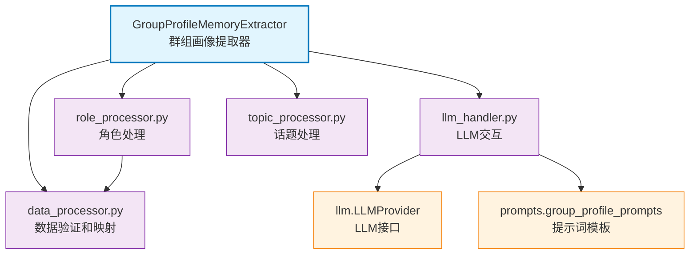

# memory_layer.memory_extractor.group_profile

群组画像提取工具包，提供数据处理、LLM 交互、角色管理、话题处理等模块化功能

## 模块位置

**源码路径**: `src/memory_layer/memory_extractor/group_profile/`
**文档路径**: `specs/ac_mod/memory_layer.memory_extractor.group_profile.ac.mod.md`
**模块类型**: 包模块（工具库）

## 目录结构

```
src/memory_layer/memory_extractor/group_profile/
├── __init__.py                 # 空文件（工具包，无导出）
├── data_processor.py           # GroupProfileDataProcessor（数据验证、转换、映射）
├── llm_handler.py              # GroupProfileLLMHandler（Prompt 构建、LLM 调用、解析）
├── role_processor.py           # RoleProcessor（角色分配、证据管理）
└── topic_processor.py          # TopicProcessor（话题去重、合并、排序）
```

## 快速开始

### 基本使用（模块化调用）

```python
from memory_layer.memory_extractor.group_profile.data_processor import GroupProfileDataProcessor
from memory_layer.memory_extractor.group_profile.llm_handler import GroupProfileLLMHandler
from memory_layer.memory_extractor.group_profile.role_processor import RoleProcessor
from memory_layer.memory_extractor.group_profile.topic_processor import TopicProcessor
from memory_layer.llm import create_provider_from_env

# 1. 初始化组件
llm_provider = create_provider_from_env("openai")
data_processor = GroupProfileDataProcessor(conversation_source="episode")
llm_handler = GroupProfileLLMHandler(llm_provider, max_topics=10)
role_processor = RoleProcessor(data_processor)
topic_processor = TopicProcessor()

# 2. 构建对话文本（通常由 GroupProfileMemoryExtractor 完成）
conversation_text = "Alice: 我负责后端开发\nBob: 我做前端\n..."

# 3. 执行并行 LLM 分析
result = await llm_handler.execute_parallel_analysis(
    conversation_text=conversation_text,
    group_id="team_dev",
    group_name="开发团队",
    memcell_list=[...],
    existing_profile={"topics": [...], "roles": {...}, "summary": "..."},
    user_organization=None,
    timespan="2024-11-01 to 2024-11-16"
)

# 4. 处理角色数据
roles = role_processor.process_roles_with_evidences(
    role_data=result["roles"],
    speaker_mapping={"speaker1": {"user_id": "alice", "user_name": "Alice"}},
    existing_roles={},
    valid_memcell_ids={"evt1", "evt2"},
    memcell_list=[...]
)

# 5. 处理话题数据
topics = topic_processor.merge_and_deduplicate_topics(
    new_topics=result["topics"],
    existing_topics=[],
    max_topics=10
)
```

### 典型集成（在 GroupProfileMemoryExtractor 中）

```python
# GroupProfileMemoryExtractor 内部使用这些工具类
from memory_layer.memory_extractor.group_profile_memory_extractor import GroupProfileMemoryExtractor

extractor = GroupProfileMemoryExtractor(llm_provider)
memories = await extractor.extract_memory(request)

# 内部调用：
# - data_processor.validate_and_filter_memcell_ids()
# - llm_handler.execute_parallel_analysis()
# - role_processor.process_roles_with_evidences()
# - topic_processor.merge_and_deduplicate_topics()
```

## 核心组件详解

### 1. GroupProfileDataProcessor（data_processor.py）

**功能**：
- 验证 MemCell ID 的存在性和合法性
- 过滤不合法的 user_id
- 合并 MemCell ID 列表（去重、验证）
- 构建 Speaker 映射（speaker_id → user_name）

**主要方法**：

| 方法 | 功能 | 参数 | 返回值 |
|------|------|------|--------|
| `validate_and_filter_memcell_ids()` | 验证并过滤 MemCell IDs | memcell_ids, valid_ids, user_id(可选), memcell_list(可选) | List[str] |
| `build_speaker_mapping()` | 构建 Speaker 映射 | memcell_list, user_id_list | Dict[speaker_id, {user_id, user_name}] |
| `merge_memcell_ids()` | 合并多个 MemCell ID 列表 | old_ids, new_ids, valid_ids | List[str] |

**使用示例**：
```python
processor = GroupProfileDataProcessor(conversation_source="episode")

# 验证 MemCell IDs
valid_ids = {"evt1", "evt2", "evt3"}
filtered_ids = processor.validate_and_filter_memcell_ids(
    memcell_ids=["evt1", "evt999"],  # evt999 不存在
    valid_ids=valid_ids
)
# 返回: ["evt1"]

# 构建 Speaker 映射
speaker_mapping = processor.build_speaker_mapping(
    memcell_list=[memcell1, memcell2],
    user_id_list=["alice", "bob"]
)
# 返回: {"speaker_alice": {"user_id": "alice", "user_name": "Alice"}, ...}
```

### 2. GroupProfileLLMHandler（llm_handler.py）

**功能**：
- 构建内容分析 Prompt（话题、摘要、主题）
- 构建行为分析 Prompt（角色）
- 并行调用 LLM（内容 + 行为）
- 解析 JSON 响应

**主要方法**：

| 方法 | 功能 | 参数 | 返回值 |
|------|------|------|--------|
| `execute_parallel_analysis()` | 执行并行 LLM 分析 | conversation_text, group_id, group_name, memcell_list, existing_profile, user_organization, timespan | Dict |
| `build_content_analysis_prompt()` | 构建内容分析 Prompt | conversation_text, group_id, group_name, existing_topics, existing_summary, existing_subject, timespan | str |
| `build_behavior_analysis_prompt()` | 构建行为分析 Prompt | conversation_text, group_id, group_name, existing_roles, user_organization, timespan | str |

**并行调用示例**：
```python
handler = GroupProfileLLMHandler(llm_provider, max_topics=10)

result = await handler.execute_parallel_analysis(
    conversation_text="对话内容...",
    group_id="team1",
    group_name="团队1",
    memcell_list=[...],
    existing_profile={"topics": [...], "roles": {...}, "summary": "..."},
    user_organization=None,
    timespan="2024-11-01 to 2024-11-16"
)

# 返回:
# {
#     "topics": [{"topic": "技术讨论", "description": "...", "evidences": [...]}, ...],
#     "roles": {"技术负责人": [{"speaker": "alice", "evidences": [...], "confidence": "strong"}]},
#     "summary": "团队主要讨论技术方案...",
#     "subject": "技术方案评审"
# }
```

### 3. RoleProcessor（role_processor.py）

**功能**：
- 处理 LLM 输出的角色数据
- 合并历史角色证据
- 验证角色合法性（基于 `GroupRole` 枚举）
- 按置信度排序（strong 在前）

**主要方法**：

| 方法 | 功能 | 参数 | 返回值 |
|------|------|------|--------|
| `process_roles_with_evidences()` | 处理角色和证据 | role_data, speaker_mapping, existing_roles, valid_memcell_ids, memcell_list | Dict[role, List[assignment]] |

**角色验证**：
```python
# 有效角色（来自 GroupRole 枚举）
VALID_ROLES = {
    "技术负责人", "产品负责人", "项目经理", "核心成员",
    "活跃成员", "普通成员", "新人", ...
}

# 过滤非法角色
role_processor.process_roles_with_evidences(
    role_data={"非法角色": [...]},  # 被过滤
    ...
)
```

**使用示例**：
```python
processor = RoleProcessor(data_processor)

roles = processor.process_roles_with_evidences(
    role_data={
        "技术负责人": [
            {"speaker": "alice", "evidences": ["evt1", "evt2"], "confidence": "strong"}
        ]
    },
    speaker_mapping={"alice": {"user_id": "alice", "user_name": "Alice"}},
    existing_roles={},
    valid_memcell_ids={"evt1", "evt2"},
    memcell_list=[...]
)

# 返回:
# {
#     "技术负责人": [
#         {
#             "user_id": "alice",
#             "user_name": "Alice",
#             "confidence": "strong",
#             "evidences": ["evt1", "evt2"]
#         }
#     ]
# }
```

### 4. TopicProcessor（topic_processor.py）

**功能**：
- 话题去重（基于相似度）
- 合并新旧话题
- 排序话题（按优先级、时间）
- 限制话题数量

**主要方法**：

| 方法 | 功能 | 参数 | 返回值 |
|------|------|------|--------|
| `merge_and_deduplicate_topics()` | 合并并去重话题 | new_topics, existing_topics, max_topics | List[Dict] |
| `calculate_topic_similarity()` | 计算话题相似度 | topic1, topic2 | float |

**去重逻辑**：
```python
# 1. 计算话题相似度（基于 topic 字段的 Jaccard 相似度）
similarity = len(set1 & set2) / len(set1 | set2)

# 2. 如果相似度 > 阈值（默认 0.6），合并证据
if similarity > 0.6:
    merged_topic = {
        "topic": topic1["topic"],
        "description": topic1["description"],
        "evidences": list(set(topic1["evidences"] + topic2["evidences"]))
    }
```

**使用示例**：
```python
processor = TopicProcessor()

topics = processor.merge_and_deduplicate_topics(
    new_topics=[
        {"topic": "技术讨论", "description": "...", "evidences": ["evt1"]},
        {"topic": "技术方案", "description": "...", "evidences": ["evt2"]}  # 与第一个相似
    ],
    existing_topics=[],
    max_topics=10
)

# 返回（去重后）:
# [
#     {"topic": "技术讨论", "description": "...", "evidences": ["evt1", "evt2"]}
# ]
```

## Mermaid 依赖图



## 依赖关系说明

### 对其他模块的依赖

通过 Grep 验证：
```bash
grep -rn "^from " src/memory_layer/memory_extractor/group_profile/*.py | grep -v "^from \."
```

**结果**：
- `core.observation.logger`: 日志记录
- `memory_layer.memory_extractor.group_profile_memory_extractor`: GroupRole 枚举
- `memory_layer.prompts.group_profile_prompts`: CONTENT_ANALYSIS_PROMPT, BEHAVIOR_ANALYSIS_PROMPT

**内部依赖**：
- `RoleProcessor` 依赖 `GroupProfileDataProcessor`
- `LLMHandler` 依赖 `llm_provider`

### 被依赖关系

通过 Grep 验证：
```bash
grep -rn "from memory_layer.memory_extractor.group_profile" src/
```

**结果**：
- `memory_layer/memory_extractor/group_profile_memory_extractor.py`: 使用所有 4 个工具类

**文档引用**：
- `specs/ac_mod/memory_layer.memory_extractor.ac.mod.md`（待创建，父包）
- `specs/ac_mod/memory_layer.prompts.ac.mod.md`

## 可运行的测试命令

```bash
# 1. 验证导入
python -c "
from memory_layer.memory_extractor.group_profile.data_processor import GroupProfileDataProcessor
from memory_layer.memory_extractor.group_profile.llm_handler import GroupProfileLLMHandler
from memory_layer.memory_extractor.group_profile.role_processor import RoleProcessor
from memory_layer.memory_extractor.group_profile.topic_processor import TopicProcessor
print('✅ Import OK')
"

# 2. 验证 DataProcessor
python -c "
from memory_layer.memory_extractor.group_profile.data_processor import GroupProfileDataProcessor
processor = GroupProfileDataProcessor()
valid_ids = processor.validate_and_filter_memcell_ids(['evt1', 'evt2'], {'evt1'})
print(f'✅ DataProcessor OK: {valid_ids}')
"

# 3. 验证 RoleProcessor
python -c "
from memory_layer.memory_extractor.group_profile.data_processor import GroupProfileDataProcessor
from memory_layer.memory_extractor.group_profile.role_processor import RoleProcessor
data_proc = GroupProfileDataProcessor()
role_proc = RoleProcessor(data_proc)
print('✅ RoleProcessor OK')
"

# 4. 验证 TopicProcessor
python -c "
from memory_layer.memory_extractor.group_profile.topic_processor import TopicProcessor
processor = TopicProcessor()
topics = processor.merge_and_deduplicate_topics([], [], max_topics=10)
print(f'✅ TopicProcessor OK: {len(topics)} topics')
"

# 5. 运行完整测试（如果存在）
pytest src/memory_layer/memory_extractor/group_profile/tests/ -v
```

## 示例场景

### 场景 1: 独立使用 DataProcessor

```python
from memory_layer.memory_extractor.group_profile.data_processor import GroupProfileDataProcessor

processor = GroupProfileDataProcessor(conversation_source="episode")

# 验证 MemCell IDs
valid_ids = {"evt1", "evt2", "evt3"}
llm_output_ids = ["evt1", "evt999", "evt2"]  # LLM 可能生成不存在的 ID

filtered_ids = processor.validate_and_filter_memcell_ids(
    memcell_ids=llm_output_ids,
    valid_ids=valid_ids
)
# 返回: ["evt1", "evt2"]（过滤掉 evt999）
```

### 场景 2: LLM 并行调用

```python
from memory_layer.memory_extractor.group_profile.llm_handler import GroupProfileLLMHandler
from memory_layer.llm import create_provider_from_env

llm_provider = create_provider_from_env("openai")
handler = GroupProfileLLMHandler(llm_provider, max_topics=10)

# 构建对话文本
conversation_text = """
Alice: 我负责后端 API 开发
Bob: 我做前端界面
Alice: 最近在做用户认证模块
"""

# 并行分析（内容 + 行为）
result = await handler.execute_parallel_analysis(
    conversation_text=conversation_text,
    group_id="team_dev",
    group_name="开发团队",
    memcell_list=[...],
    existing_profile=None,
    user_organization=None,
    timespan="2024-11-01 to 2024-11-16"
)

print(f"话题: {result['topics']}")
print(f"角色: {result['roles']}")
print(f"摘要: {result['summary']}")
```

### 场景 3: 角色处理

```python
from memory_layer.memory_extractor.group_profile.role_processor import RoleProcessor
from memory_layer.memory_extractor.group_profile.data_processor import GroupProfileDataProcessor

data_proc = GroupProfileDataProcessor()
role_proc = RoleProcessor(data_proc)

# LLM 输出的角色数据
role_data = {
    "技术负责人": [
        {"speaker": "alice", "evidences": ["evt1", "evt2"], "confidence": "strong"}
    ],
    "核心成员": [
        {"speaker": "bob", "evidences": ["evt3"], "confidence": "weak"}
    ]
}

# 处理角色
roles = role_proc.process_roles_with_evidences(
    role_data=role_data,
    speaker_mapping={"alice": {"user_id": "alice", "user_name": "Alice"}},
    existing_roles={},
    valid_memcell_ids={"evt1", "evt2", "evt3"},
    memcell_list=[...]
)

# 输出: strong 角色在前
for role_name, assignments in roles.items():
    for assignment in assignments:
        print(f"{assignment['user_name']}: {role_name} ({assignment['confidence']})")
```

### 场景 4: 话题去重

```python
from memory_layer.memory_extractor.group_profile.topic_processor import TopicProcessor

processor = TopicProcessor()

new_topics = [
    {"topic": "技术讨论", "description": "关于架构设计", "evidences": ["evt1"]},
    {"topic": "技术方案", "description": "关于架构设计", "evidences": ["evt2"]},  # 相似
    {"topic": "项目排期", "description": "关于进度安排", "evidences": ["evt3"]}
]

# 合并并去重
merged_topics = processor.merge_and_deduplicate_topics(
    new_topics=new_topics,
    existing_topics=[],
    max_topics=10
)

# 输出: 2 个话题（技术相关的被合并）
for topic in merged_topics:
    print(f"{topic['topic']}: {len(topic['evidences'])} evidences")
```

## 设计原则

**模块化**：
- 每个类负责单一职责（SRP）
- 便于单元测试和维护

**验证驱动**：
- 所有 LLM 输出都需验证（MemCell ID、角色名称）
- 防止幻觉数据污染

**可扩展性**：
- 数据处理逻辑集中在 DataProcessor
- 新增字段只需修改 DataProcessor

## 扩展阅读

- **GroupProfileMemoryExtractor**：`specs/ac_mod/memory_layer.memory_extractor.ac.mod.md`（待创建）
- **提示词模板**：`specs/ac_mod/memory_layer.prompts.ac.mod.md`
- **LLM Provider**：`specs/ac_mod/memory_layer.llm.ac.mod.md`
