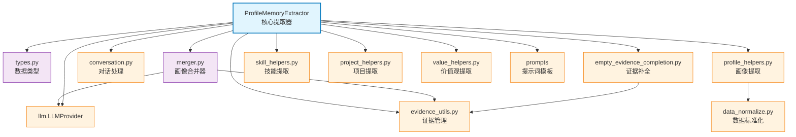

# memory_layer.memory_extractor.profile_memory

个人画像提取工具包，提供对话解析、证据管理、画像合并、技能/项目/价值观提取等完整功能

## 模块位置

**源码路径**: `src/memory_layer/memory_extractor/profile_memory/`
**文档路径**: `specs/ac_mod/memory_layer.memory_extractor.profile_memory.ac.mod.md`
**模块类型**: 包模块（工具库 + 核心提取器）

## 目录结构

```
src/memory_layer/memory_extractor/profile_memory/
├── __init__.py                        # 导出核心类型（ProfileMemory, ProfileMemoryExtractor 等）
├── types.py                           # 数据类型（ProfileMemory, ProjectInfo, ImportanceEvidence）
├── extractor.py                       # ProfileMemoryExtractor 核心提取器
├── merger.py                          # ProfileMemoryMerger 画像合并器
├── conversation.py                    # 对话文本构建和解析
├── evidence_utils.py                  # 证据管理工具（验证、格式化、去重）
├── empty_evidence_completion.py       # 空证据补全（为旧数据补充证据）
├── data_normalize.py                  # 数据标准化（兼容旧格式）
├── profile_helpers.py                 # 通用画像字段提取辅助函数
├── skill_helpers.py                   # 技能提取辅助函数
├── project_helpers.py                 # 项目提取辅助函数
└── value_helpers.py                   # 价值观系统提取辅助函数
```

## 快速开始

### 基本使用

```python
from memory_layer.memory_extractor.profile_memory import (
    ProfileMemoryExtractor,
    ProfileMemoryExtractRequest,
    ProfileMemory,
    ProfileMemoryMerger
)
from memory_layer.llm import create_provider_from_env

# 1. 创建提取器
llm_provider = create_provider_from_env("openai")
extractor = ProfileMemoryExtractor(llm_provider)

# 2. 构建请求
request = ProfileMemoryExtractRequest(
    memcell_list=[memcell1, memcell2, ...],
    user_id_list=["alice"],
    group_id="team_dev",
    old_memory_list=[]  # 历史画像（用于合并）
)

# 3. 提取画像
memories = await extractor.extract_memory(request)

# 4. 访问画像数据
for memory in memories:
    profile = memory  # ProfileMemory 实例
    print(f"用户: {profile.user_name}")
    print(f"硬技能: {profile.hard_skills}")
    print(f"软技能: {profile.soft_skills}")
    print(f"项目: {profile.projects_participated}")
```

### 画像合并

```python
from memory_layer.memory_extractor.profile_memory import ProfileMemoryMerger

# 1. 创建合并器
merger = ProfileMemoryMerger(llm_provider)

# 2. 合并新旧画像
merged_profile = await merger.merge_profiles(
    old_profile=old_profile_memory,
    new_profile=new_profile_memory
)

# 3. 智能合并逻辑
# - 去重（基于证据 ID）
# - 保留最新值
# - 合并证据列表
```

## 核心组件详解

### 1. ProfileMemoryExtractor（extractor.py）

**功能**：
- 从 MemCell 列表提取用户画像
- 支持分阶段提取（Part1/Part2/Part3）
- 智能证据补全（为空证据字段补充默认证据）
- 合并历史画像

**主要方法**：

| 方法 | 功能 | 参数 | 返回值 |
|------|------|------|--------|
| `extract_memory()` | 提取画像 | ProfileMemoryExtractRequest | List[Memory] |
| `extract_profile()` | 提取单个用户画像 | memcell_list, user_id, group_id, old_profile | ProfileMemory |

**提取流程**：
```
1. 构建对话文本（conversation.py）
2. Part1: 基础画像（技能、决策、性格）
3. Part2: 项目画像（projects_participated）
4. Part3: 价值观系统（motivation, fear, value）
5. 证据补全（empty_evidence_completion.py）
6. 合并历史画像（merger.py）
7. 返回 ProfileMemory
```

### 2. ProfileMemory（types.py）

**字段结构**：

| 字段 | 类型 | 说明 | 示例 |
|------|------|------|------|
| `user_name` | str | 用户名称 | "Alice" |
| `hard_skills` | List[Dict] | 硬技能 | `[{"value": "Python", "level": "高级", "evidences": ["evt1"]}]` |
| `soft_skills` | List[Dict] | 软技能 | `[{"value": "沟通", "level": "中级", "evidences": ["evt2"]}]` |
| `way_of_decision_making` | List[Dict] | 决策方式 | `[{"value": "数据驱动", "evidences": ["evt3"]}]` |
| `personality` | List[Dict] | 性格特质 | `[{"value": "外向", "evidences": ["evt4"]}]` |
| `projects_participated` | List[ProjectInfo] | 参与项目 | `[ProjectInfo(...)]` |
| `user_goal` | List[Dict] | 用户目标 | `[{"value": "成为技术专家", "evidences": ["evt5"]}]` |
| `work_responsibility` | List[Dict] | 工作职责 | `[{"value": "后端开发", "evidences": ["evt6"]}]` |
| `working_habit_preference` | List[Dict] | 工作习惯 | `[{"value": "早起工作", "evidences": ["evt7"]}]` |
| `interests` | List[Dict] | 兴趣爱好 | `[{"value": "阅读技术书籍", "evidences": ["evt8"]}]` |
| `tendency` | List[Dict] | 倾向 | `[{"value": "喜欢挑战", "evidences": ["evt9"]}]` |
| `motivation_system` | List[Dict] | 动机系统 | `[{"value": "成就感", "level": "high", "evidences": ["evt10"]}]` |
| `fear_system` | List[Dict] | 恐惧系统 | `[{"value": "失败", "level": "medium", "evidences": ["evt11"]}]` |
| `value_system` | List[Dict] | 价值观系统 | `[{"value": "创新", "level": "high", "evidences": ["evt12"]}]` |
| `humor_use` | List[Dict] | 幽默使用 | `[{"value": "自嘲式幽默", "evidences": ["evt13"]}]` |
| `colloquialism` | List[Dict] | 口语化表达 | `[{"value": "东北话", "evidences": ["evt14"]}]` |

**证据格式**：
```python
# 标准格式（推荐）
evidences = ["2024-11-16|evt_12345"]

# 旧格式（兼容）
evidences = ["evt_12345"]
```

### 3. ProfileMemoryMerger（merger.py）

**功能**：
- 合并新旧画像
- 去重证据（基于 event_id）
- 保留最新值
- 智能合并列表字段

**合并策略**：

| 字段类型 | 策略 | 示例 |
|---------|------|------|
| `hard_skills` | 按 value 去重，合并 evidences | `{"value": "Python", "evidences": ["evt1", "evt2"]}` |
| `projects_participated` | 按 project_id 去重，合并子字段 | `ProjectInfo(project_id="proj1", ...)` |
| `motivation_system` | 按 value 去重，取最新 level | `{"value": "成就感", "level": "high"}` |

**使用示例**：
```python
merger = ProfileMemoryMerger(llm_provider)

# 旧画像
old_profile = ProfileMemory(
    user_id="alice",
    hard_skills=[{"value": "Python", "level": "中级", "evidences": ["evt1"]}],
    ...
)

# 新画像
new_profile = ProfileMemory(
    user_id="alice",
    hard_skills=[{"value": "Python", "level": "高级", "evidences": ["evt2"]}],
    ...
)

# 合并
merged = await merger.merge_profiles(old_profile, new_profile)

# 结果
# merged.hard_skills = [{"value": "Python", "level": "高级", "evidences": ["evt1", "evt2"]}]
```

### 4. 辅助工具模块

**conversation.py**：
- `build_conversation_text()`: 构建对话文本（从 MemCell 列表）
- `parse_conversation()`: 解析对话（提取 speaker 和 content）

**evidence_utils.py**：
- `validate_evidences()`: 验证证据格式
- `format_evidence()`: 格式化证据（日期 | event_id）
- `deduplicate_evidences()`: 去重证据

**empty_evidence_completion.py**：
- `complete_empty_evidences()`: 为空证据字段补充默认证据
- 用于兼容旧数据（Part1/Part2 提取时可能未返回证据）

**data_normalize.py**：
- `normalize_profile_data()`: 标准化画像数据（兼容旧格式）
- 例如：`{"skill": "Python"}` → `{"value": "Python"}`

**profile_helpers.py**：
- 通用画像字段提取（决策、性格、目标等）

**skill_helpers.py**：
- 技能提取和处理（硬技能、软技能）

**project_helpers.py**：
- 项目信息提取和合并

**value_helpers.py**：
- 价值观系统提取（动机、恐惧、价值观）

## Mermaid 依赖图



## 依赖关系说明

### 对其他模块的依赖

通过 Grep 验证：
```bash
grep -rn "^from " src/memory_layer/memory_extractor/profile_memory/*.py | grep -v "^from \."
```

**结果**：
- `memory_layer.llm.llm_provider`: LLMProvider
- `memory_layer.types`: Memory, MemoryType
- `memory_layer.prompts`: CONVERSATION_PROFILE_PART1_EXTRACTION_PROMPT, CONVERSATION_PROFILE_PART2_EXTRACTION_PROMPT, CONVERSATION_PROFILE_PART3_EXTRACTION_PROMPT
- `core.observation.logger`: 日志记录
- `common_utils.datetime_utils`: 时间格式化

**文档引用**：
- `specs/ac_mod/memory_layer.llm.ac.mod.md`
- `specs/ac_mod/memory_layer.prompts.ac.mod.md`

### 被依赖关系

通过 Grep 验证：
```bash
grep -rn "from memory_layer.memory_extractor.profile_memory" src/
```

**结果**：
- `memory_layer/profile_manager/manager.py`: 使用 ProfileMemoryExtractor, ProfileMemoryExtractRequest
- `biz_layer/mem_db_operations.py`: 使用 ProfileMemory, ProjectInfo

**文档引用**：
- `specs/ac_mod/memory_layer.profile_manager.ac.mod.md`
- `specs/ac_mod/biz_layer.mem_db_operations.ac.mod.md`（待创建）

## 可运行的测试命令

```bash
# 1. 验证导入
python -c "
from memory_layer.memory_extractor.profile_memory import (
    ProfileMemoryExtractor,
    ProfileMemory,
    ProfileMemoryMerger,
    ProjectInfo
)
print('✅ Import OK')
"

# 2. 验证 ProfileMemory 创建
python -c "
from memory_layer.memory_extractor.profile_memory import ProfileMemory
import datetime
profile = ProfileMemory(
    memory_type=None,
    user_id='alice',
    timestamp=datetime.datetime.now(),
    ori_event_id_list=['evt1'],
    user_name='Alice',
    hard_skills=[{'value': 'Python', 'level': '高级', 'evidences': ['evt1']}]
)
print(f'✅ ProfileMemory OK: {profile.user_name}')
"

# 3. 验证 Extractor 实例化
python -c "
from memory_layer.memory_extractor.profile_memory import ProfileMemoryExtractor
from memory_layer.llm import create_provider
import asyncio

async def test():
    llm = create_provider('openai', api_key='test', base_url='http://localhost')
    extractor = ProfileMemoryExtractor(llm)
    print('✅ Extractor OK')

asyncio.run(test())
"

# 4. 验证 Merger
python -c "
from memory_layer.memory_extractor.profile_memory import ProfileMemoryMerger
from memory_layer.llm import create_provider

llm = create_provider('openai', api_key='test', base_url='http://localhost')
merger = ProfileMemoryMerger(llm)
print('✅ Merger OK')
"

# 5. 验证辅助工具
python -c "
from memory_layer.memory_extractor.profile_memory.evidence_utils import validate_evidences, format_evidence
evidence = format_evidence('evt123', '2024-11-16')
print(f'✅ Evidence utils OK: {evidence}')
"

# 6. 运行完整测试（如果存在）
pytest src/memory_layer/memory_extractor/profile_memory/tests/ -v
```

## 示例场景

### 场景 1: 完整画像提取

```python
from memory_layer.memory_extractor.profile_memory import (
    ProfileMemoryExtractor,
    ProfileMemoryExtractRequest
)
from memory_layer.llm import create_provider_from_env

# 1. 创建提取器
llm = create_provider_from_env("openai")
extractor = ProfileMemoryExtractor(llm)

# 2. 准备 MemCell 列表
memcell_list = [
    # MemCell 对象（包含对话内容）
]

# 3. 构建请求
request = ProfileMemoryExtractRequest(
    memcell_list=memcell_list,
    user_id_list=["alice"],
    group_id="team_dev",
    old_memory_list=[]  # 无历史画像
)

# 4. 提取画像
memories = await extractor.extract_memory(request)

# 5. 访问画像
profile = memories[0]
print(f"用户: {profile.user_name}")
print(f"硬技能: {profile.hard_skills}")
print(f"软技能: {profile.soft_skills}")
print(f"项目: {[p.project_name for p in profile.projects_participated]}")
print(f"价值观: {profile.value_system}")
```

### 场景 2: 增量更新画像

```python
# 1. 加载历史画像
old_profile = load_profile_from_db("alice")

# 2. 提取新画像（带历史画像）
request = ProfileMemoryExtractRequest(
    memcell_list=new_memcells,
    user_id_list=["alice"],
    group_id="team_dev",
    old_memory_list=[old_profile]  # 传入历史画像
)

memories = await extractor.extract_memory(request)
updated_profile = memories[0]

# 3. 合并后的画像包含：
# - 旧画像的所有字段
# - 新画像的更新字段
# - 合并后的证据列表
```

### 场景 3: 证据管理

```python
from memory_layer.memory_extractor.profile_memory.evidence_utils import (
    format_evidence,
    validate_evidences,
    deduplicate_evidences
)

# 1. 格式化证据
evidence = format_evidence("evt123", "2024-11-16")
# 返回: "2024-11-16|evt123"

# 2. 验证证据列表
evidences = ["2024-11-16|evt1", "2024-11-17|evt2"]
valid = validate_evidences(evidences, valid_ids={"evt1", "evt2"})
# 返回: True

# 3. 去重证据
deduplicated = deduplicate_evidences(["evt1", "evt1", "evt2"])
# 返回: ["evt1", "evt2"]
```

### 场景 4: 空证据补全

```python
from memory_layer.memory_extractor.profile_memory.empty_evidence_completion import (
    complete_empty_evidences
)

# 1. 旧数据（无证据）
profile_data = {
    "hard_skills": [{"value": "Python", "level": "高级"}],  # 缺少 evidences
    "soft_skills": [{"value": "沟通", "level": "中级", "evidences": []}]  # 空证据
}

# 2. 补全证据
completed = complete_empty_evidences(
    profile_data,
    default_evidence="2024-11-16|default_evt"
)

# 3. 结果
# {
#     "hard_skills": [{"value": "Python", "level": "高级", "evidences": ["2024-11-16|default_evt"]}],
#     "soft_skills": [{"value": "沟通", "level": "中级", "evidences": ["2024-11-16|default_evt"]}]
# }
```

### 场景 5: 项目信息提取

```python
from memory_layer.memory_extractor.profile_memory import ProjectInfo

# LLM 提取的项目信息
project = ProjectInfo(
    project_id="proj_001",
    project_name="用户管理系统",
    entry_date="2024-01-01",
    subtasks=[
        {"value": "设计数据库", "evidences": ["evt1"]},
        {"value": "实现 API", "evidences": ["evt2"]}
    ],
    user_objective=[
        {"value": "负责后端开发", "evidences": ["evt3"]}
    ],
    contributions=[
        {"value": "完成认证模块", "evidences": ["evt4"]}
    ],
    user_concerns=[
        {"value": "性能优化", "evidences": ["evt5"]}
    ]
)

# 访问项目字段
print(f"项目: {project.project_name}")
print(f"子任务: {project.subtasks}")
```

## 数据格式标准

**标准格式（推荐）**：
```python
{
    "value": "Python",
    "level": "高级",  # 可选（技能、价值观系统）
    "evidences": ["2024-11-16|evt123", "2024-11-17|evt456"]
}
```

**旧格式（兼容）**：
```python
{
    "skill": "Python",  # 被标准化为 "value"
    "level": "高级",
    "evidences": ["evt123"]  # 无日期前缀
}
```

## 性能优化

**分阶段提取**：
- Part1: 基础画像（快速）
- Part2: 项目画像（仅当检测到项目时）
- Part3: 价值观系统（深度分析）

**证据缓存**：
- 证据去重在内存中完成
- 避免重复 LLM 调用

**合并优化**：
- 仅合并变化的字段
- 跳过空字段

## 扩展阅读

- **ProfileManager**：`specs/ac_mod/memory_layer.profile_manager.ac.mod.md`
- **提示词模板**：`specs/ac_mod/memory_layer.prompts.ac.mod.md`
- **LLM Provider**：`specs/ac_mod/memory_layer.llm.ac.mod.md`
