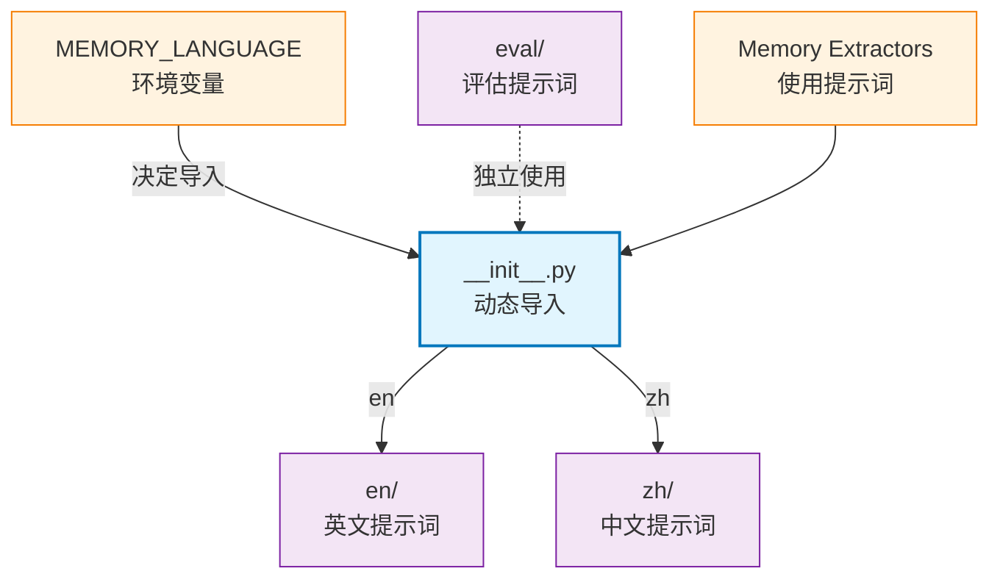

# memory_layer.prompts

多语言提示词模板包，通过环境变量动态切换语言（en/zh），支持评估场景（eval）

## 模块位置

**源码路径**: `src/memory_layer/prompts/`
**文档路径**: `specs/ac_mod/memory_layer.prompts.ac.mod.md`
**模块类型**: 包模块

## 目录结构

```
src/memory_layer/prompts/
├── __init__.py                 # 动态导入，根据 MEMORY_LANGUAGE 环境变量切换语言
├── en/                         # 英文提示词（12 个文件）
├── zh/                         # 中文提示词（12 个文件）
└── eval/                       # 评估提示词（7 个文件）
```

## 快速开始

### 使用默认语言（英文）

```python
from memory_layer.prompts import (
    CONV_BOUNDARY_DETECTION_PROMPT,
    CONV_SUMMARY_PROMPT,
    EPISODE_GENERATION_PROMPT,
    CONVERSATION_PROFILE_PART1_EXTRACTION_PROMPT,
    get_semantic_generation_prompt
)

# 直接使用提示词模板
prompt = CONV_BOUNDARY_DETECTION_PROMPT.format(
    conversation_history="...",
    time_gap_info="...",
    new_messages="..."
)
```

### 切换语言

```bash
# 设置环境变量为中文
export MEMORY_LANGUAGE=zh

# 重启应用，提示词自动切换为中文
python your_app.py
```

### 查询当前语言

```python
from memory_layer.prompts import get_current_language, CURRENT_LANGUAGE

print(f"当前语言: {get_current_language()}")
print(f"支持语言: en, zh")
```

## 核心组件详解

### 1. 动态语言切换（__init__.py）

**机制**：
```python
import os
MEMORY_LANGUAGE = os.getenv('MEMORY_LANGUAGE', 'en').lower()

if MEMORY_LANGUAGE == 'zh':
    from .zh.conv_prompts import CONV_BOUNDARY_DETECTION_PROMPT
else:
    from .en.conv_prompts import CONV_BOUNDARY_DETECTION_PROMPT
```

**支持的语言**：
- `en`: 英文（默认）
- `zh`: 中文

**环境变量**：
| 变量 | 值 | 说明 |
|------|------|------|
| `MEMORY_LANGUAGE` | `en` | 英文提示词（默认） |
| `MEMORY_LANGUAGE` | `zh` | 中文提示词 |

### 2. 提示词类型

**对话处理**：
- `CONV_BOUNDARY_DETECTION_PROMPT`: 对话边界检测
- `CONV_SUMMARY_PROMPT`: 对话摘要生成

**Episode 记忆**：
- `EPISODE_GENERATION_PROMPT`: 个人 Episode 生成
- `GROUP_EPISODE_GENERATION_PROMPT`: 群组 Episode 生成
- `DEFAULT_CUSTOM_INSTRUCTIONS`: 默认自定义指令

**Profile 画像**：
- `CONVERSATION_PROFILE_EXTRACTION_PROMPT`: 完整画像提取
- `CONVERSATION_PROFILE_PART1_EXTRACTION_PROMPT`: 基础画像（技能、性格）
- `CONVERSATION_PROFILE_PART2_EXTRACTION_PROMPT`: 项目画像
- `CONVERSATION_PROFILE_PART3_EXTRACTION_PROMPT`: 价值观系统
- `CONVERSATION_PROFILE_EVIDENCE_COMPLETION_PROMPT`: 证据补全

**Group Profile 画像**：
- `CONTENT_ANALYSIS_PROMPT`: 内容分析（话题、摘要）
- `BEHAVIOR_ANALYSIS_PROMPT`: 行为分析（角色）

**Semantic 语义记忆**：
- `get_semantic_generation_prompt()`: 语义记忆生成（函数）
- `get_group_semantic_generation_prompt()`: 群组语义记忆生成（函数）

**Event Log 事件日志**：
- `EVENT_LOG_PROMPT`: 事件日志提取

### 3. 子模块说明

**en（英文）**：12 个文件
- `conv_prompts.py`: 对话处理
- `episode_mem_prompts.py`: Episode 记忆
- `profile_mem_prompts.py`: Profile 画像（完整）
- `profile_mem_part1_prompts.py`: Profile 画像（Part1）
- `profile_mem_part2_prompts.py`: Profile 画像（Part2）
- `profile_mem_part3_prompts.py`: Profile 画像（Part3）
- `profile_mem_evidence_completion_prompt.py`: 证据补全
- `group_profile_prompts.py`: Group Profile 画像
- `group_profile_merge_prompts.py`: Group Profile 合并
- `semantic_mem_prompts.py`: Semantic 语义记忆
- `event_log_prompts.py`: Event Log 事件日志

**zh（中文）**：12 个文件（与 en 对应）

**eval（评估）**：7 个文件
- `conv_prompts.py`
- `episode_mem_prompts.py`
- `event_log_prompts.py`
- `group_profile_prompts.py`
- `email_prompts.py`: 邮件处理
- `linkdoc_prompts.py`: 文档链接处理

详见：
- `specs/ac_mod/memory_layer.prompts.en.ac.mod.md`
- `specs/ac_mod/memory_layer.prompts.zh.ac.mod.md`
- `specs/ac_mod/memory_layer.prompts.eval.ac.mod.md`

## Mermaid 依赖图



## 依赖关系说明

### 对其他模块的依赖

**无外部依赖**（仅依赖标准库 `os`）

### 被依赖关系

通过 Grep 验证：
```bash
grep -rn "from memory_layer.prompts\|from \.prompts" src/memory_layer/
```

**结果**：
- `memory_layer/memory_extractor/profile_memory_extractor.py`
- `memory_layer/memory_extractor/group_profile_memory_extractor.py`
- `memory_layer/memory_extractor/episode_memory_extractor.py`
- `memory_layer/memory_extractor/semantic_memory_extractor.py`
- `memory_layer/memory_extractor/event_log_extractor.py`
- `memory_layer/memcell_extractor/conv_memcell_extractor.py`
- `memory_layer/memory_extractor/group_profile/llm_handler.py`

**文档引用**：
- `specs/ac_mod/memory_layer.memory_extractor.ac.mod.md`（所有提取器）

## 可运行的测试命令

```bash
# 1. 验证导入（默认英文）
python -c "
from memory_layer.prompts import (
    CONV_BOUNDARY_DETECTION_PROMPT,
    EPISODE_GENERATION_PROMPT,
    CONVERSATION_PROFILE_PART1_EXTRACTION_PROMPT
)
print('✅ English prompts loaded')
"

# 2. 验证中文切换
export MEMORY_LANGUAGE=zh
python -c "
from memory_layer.prompts import CONV_BOUNDARY_DETECTION_PROMPT
print(f'✅ Chinese prompts loaded: {len(CONV_BOUNDARY_DETECTION_PROMPT)} chars')
"

# 3. 验证语言查询
python -c "
from memory_layer.prompts import get_current_language
print(f'✅ Current language: {get_current_language()}')
"

# 4. 验证 eval 提示词
python -c "
from memory_layer.prompts.eval import conv_prompts, episode_mem_prompts
print('✅ Eval prompts loaded')
"

# 5. 验证函数式提示词
python -c "
from memory_layer.prompts import get_semantic_generation_prompt
prompt = get_semantic_generation_prompt('episode text', 'user context')
print(f'✅ Function prompt OK: {len(prompt)} chars')
"
```

## 示例场景

### 场景 1: 对话边界检测

```python
from memory_layer.prompts import CONV_BOUNDARY_DETECTION_PROMPT

prompt = CONV_BOUNDARY_DETECTION_PROMPT.format(
    conversation_history="Alice: Hello\nBob: Hi",
    time_gap_info="5 minutes",
    new_messages="Alice: How are you?"
)

response = await llm_provider.generate(prompt)
# 返回: {"start_new_episode": false, "reason": "..."}
```

### 场景 2: 画像提取（分阶段）

```python
from memory_layer.prompts import (
    CONVERSATION_PROFILE_PART1_EXTRACTION_PROMPT,
    CONVERSATION_PROFILE_PART2_EXTRACTION_PROMPT,
    CONVERSATION_PROFILE_PART3_EXTRACTION_PROMPT
)

# Part1: 基础画像
prompt1 = CONVERSATION_PROFILE_PART1_EXTRACTION_PROMPT.format(
    conversation_text="...",
    user_id="alice",
    existing_profile="{}"
)

# Part2: 项目画像
prompt2 = CONVERSATION_PROFILE_PART2_EXTRACTION_PROMPT.format(...)

# Part3: 价值观系统
prompt3 = CONVERSATION_PROFILE_PART3_EXTRACTION_PROMPT.format(...)
```

### 场景 3: 语言切换

```bash
# 开发环境（英文）
export MEMORY_LANGUAGE=en
python main.py

# 生产环境（中文）
export MEMORY_LANGUAGE=zh
python main.py
```

### 场景 4: 评估场景

```python
# 使用评估提示词（与生产提示词隔离）
from memory_layer.prompts.eval import conv_prompts, episode_mem_prompts

eval_prompt = conv_prompts.CONV_BOUNDARY_DETECTION_PROMPT
# ... 评估逻辑
```

## 设计原则

**语言隔离**：
- en/zh 完全隔离，互不影响
- 环境变量控制，无需修改代码

**版本对齐**：
- en/zh 提示词功能对齐
- 变量名保持一致

**评估独立**：
- eval 提示词独立于 en/zh
- 用于 A/B 测试和评估

## 提示词工程最佳实践

**结构化输出**：
- 使用 JSON 格式约束
- 明确字段类型和示例

**上下文控制**：
- 限制上下文长度
- 关键信息前置

**Few-shot 示例**：
- 提供 2-3 个示例
- 覆盖边界情况

## 扩展阅读

- **英文提示词详解**：`specs/ac_mod/memory_layer.prompts.en.ac.mod.md`
- **中文提示词详解**：`specs/ac_mod/memory_layer.prompts.zh.ac.mod.md`
- **评估提示词详解**：`specs/ac_mod/memory_layer.prompts.eval.ac.mod.md`
- **Memory Extractors**：`specs/ac_mod/memory_layer.memory_extractor.ac.mod.md`
