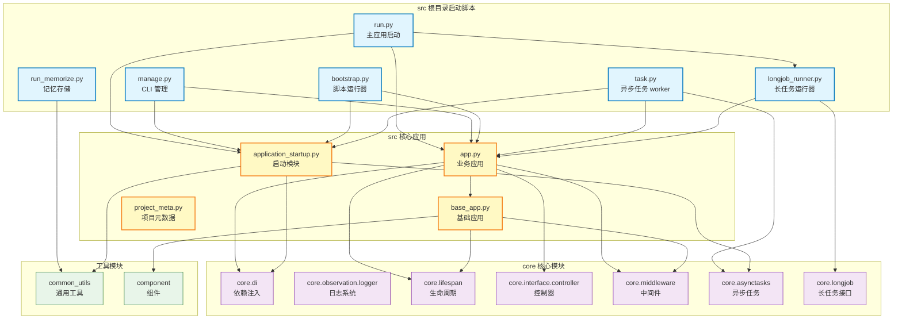

# src 根目录

应用启动和配置中心，提供 FastAPI 应用、CLI 管理、长任务运行、异步任务处理等核心启动入口

## 模块位置

**源码路径**: `src/`
**文档路径**: `specs/ac_mod/src.ac.mod.md`
**模块类型**: 包模块

## 目录结构

```
src/
├── __init__.py                  # 包初始化（项目版本、作者信息）
├── app.py                       # FastAPI 业务应用入口（控制器注册、能力加载）
├── base_app.py                  # FastAPI 基础配置（CORS、中间件、生命周期）
├── application_startup.py       # 应用启动模块（依赖注入、任务扫描）
├── run.py                       # 主应用启动脚本（uvicorn 服务器）
├── manage.py                    # Typer CLI 管理脚本（交互式 shell）
├── longjob_runner.py            # 长任务运行器（LongJob 模式）
├── bootstrap.py                 # 通用上下文加载器（脚本运行器）
├── task.py                      # 异步任务处理器（arq worker）
├── run_memorize.py              # 群聊记忆存储脚本（GroupChatFormat 转换）
├── project_meta.py              # 项目元数据（项目名称、版本）
├── agentic_layer/               # 智能体层（业务逻辑）
├── biz_layer/                   # 业务层
├── common_utils/                # 通用工具（路径、时间、文本）
├── component/                   # 组件（配置、数据库、LLM）
├── config/                      # 配置文件
├── core/                        # 核心模块（DI、日志、中间件）
├── infra_layer/                 # 基础设施层（API、数据库）
├── memory_layer/                # 记忆层（记忆提取、存储）
└── migrations/                  # 数据库迁移
```

## 快速开始

### 基本使用方式

```python
# 1. 启动 Web 应用
python src/run.py

# 2. 启动 CLI 交互式 shell
python src/manage.py shell

# 3. 启动长任务
python src/run.py --longjob kafka_consumer

# 4. 启动异步任务处理器
arq task.WorkerSettings

# 5. 运行脚本（自动加载上下文）
python src/bootstrap.py tests/my_script.py

# 6. 存储群聊记忆
python src/bootstrap.py src/run_memorize.py --input data/chat.json --api-url http://localhost:1995/api/v3/agentic/memorize --scene group_chat
```

### 导入应用实例

```python
# 导入 FastAPI 应用实例
from app import app

# 导入创建应用的函数
from app import create_business_app
from base_app import create_base_app

# 导入启动模块
from application_startup import setup_all

# 手动启动应用生命周期
await app.start_lifespan()
# 执行操作...
await app.exit_lifespan()
```

### 启动参数

| 脚本 | 参数 | 说明 |
|------|------|------|
| run.py | --host | 服务器监听主机（默认 0.0.0.0） |
|  | --port | 服务器监听端口（默认 1995） |
|  | --env-file | 环境变量文件（默认 .env） |
|  | --mock | 启用 Mock 模式 |
|  | --longjob | 启动长任务（如 kafka_consumer） |
| manage.py | shell | 启动交互式 shell |
|  | --debug | 启用调试模式 |
|  | --env-file | 环境变量文件 |
| bootstrap.py | script_path | 要运行的脚本路径 |
|  | script_args | 传递给脚本的参数 |
|  | --env-file | 环境变量文件 |
|  | --mock | 启用 Mock 模式 |

## 核心组件详解

### 1. app.py - FastAPI 业务应用

**核心功能：**
- 创建包含业务逻辑的 FastAPI 应用
- 注册控制器（BaseController）
- 加载应用能力（ApplicationCapability）
- 注册业务图结构（LangGraph）
- 配置业务中间件

**主要函数：**
```python
def register_controllers(fastapi_app: FastAPI)
    """注册所有控制器到 FastAPI 应用"""

def register_capabilities(fastapi_app: FastAPI)
    """注册所有应用能力（从 DI 容器获取）"""

def register_graphs(fastapi_app: FastAPI)
    """注册所有图结构到 FastAPI 应用状态"""

def create_business_app(...) -> FastAPI
    """创建包含业务逻辑的完整应用"""
```

**使用示例：**
```python
from app import app, create_business_app

# 使用默认应用实例
print(app.title)  # 访问应用配置

# 创建自定义应用
custom_app = create_business_app(
    cors_origins=["http://localhost:3000"],
    cors_allow_credentials=True
)
```

### 2. base_app.py - FastAPI 基础配置

**核心功能：**
- 创建业务无关的 FastAPI 基础应用
- 配置 CORS 中间件
- 配置全局异常处理器
- 管理应用生命周期（lifespan）
- 手动启动/关闭生命周期

**主要函数：**
```python
def create_base_app(...) -> FastAPI
    """创建基础 FastAPI 应用"""

async def manually_start_lifespan(app: FastAPI)
    """手动启动应用生命周期（不启动 HTTP 服务器）"""

async def close_database_connection()
    """关闭数据库连接池"""
```

**生命周期管理：**
```python
from app import app

# 方式1：使用挂载的方法（推荐）
await app.start_lifespan()
# 执行操作...
await app.exit_lifespan()

# 方式2：使用上下文管理器
async with app.router.lifespan_context(app):
    # 执行需要应用上下文的操作
    pass
```

**环境控制：**
- ENV=dev → 启用 /docs、/redoc
- ENV=prod → 禁用 API 文档

### 3. application_startup.py - 应用启动模块

**核心功能：**
- 设置依赖注入容器（ComponentScanner）
- 扫描并注册组件（@component 装饰器）
- 设置异步任务（TaskManager）
- 扫描并注册任务（@task 装饰器）

**主要函数：**
```python
def setup_dependency_injection(scan_paths=None) -> ComponentScanner
    """设置依赖注入框架"""

def setup_async_tasks(task_directories=None)
    """设置异步任务"""

def setup_all(scan_paths=None, task_directories=None) -> ComponentScanner
    """设置所有组件"""
```

**默认扫描路径：**
```python
scan_paths = [
    "core/interface/controller/debug",
    "core/lifespan",
    "core/lock",
    "core/cache",
    "component",
    "infra_layer",
    "agentic_layer",
    "biz_layer",
]

task_directories = [
    "core/asynctasks/examples",
    "infra_layer/adapters/input/jobs",
]
```

**使用示例：**
```python
from application_startup import setup_all

# 启动所有组件
scanner = setup_all()

# 自定义扫描路径
scanner = setup_all(
    scan_paths=["custom/path"],
    task_directories=["custom/tasks"]
)
```

### 4. run.py - 主应用启动脚本

**核心功能：**
- 解析命令行参数
- 加载环境变量（.env）
- 启动依赖注入和任务管理
- 启动 uvicorn HTTP 服务器
- 支持 LongJob 模式

**命令行参数：**
```bash
python src/run.py \
  --host 0.0.0.0 \
  --port 1995 \
  --env-file .env \
  --mock \
  --longjob kafka_consumer
```

**启动流程：**
1. 解析命令行参数
2. setup_environment() - 加载环境变量
3. setup_all() - 依赖注入和任务管理
4. 检查 --longjob 参数
   - 是：run_longjob_mode()
   - 否：uvicorn.run(app)

### 5. manage.py - CLI 管理脚本

**核心功能：**
- 提供 Typer CLI 命令
- 交互式 shell（IPython）
- 应用上下文装饰器
- 完整上下文装饰器（ContextManager）

**主要命令：**
```python
@cli.command()
def shell(debug: bool, env_file: str)
    """启动交互式 shell"""

@cli.command()
def list_commands(show_all: bool, env_file: str)
    """列出所有可用的 CLI 命令"""
```

**装饰器：**
```python
@with_app_context
async def my_command():
    """提供 FastAPI 应用上下文"""

@with_full_context_decorator
async def my_command():
    """提供完整上下文（ContextManager）"""
```

**使用示例：**
```bash
# 启动交互式 shell
python src/manage.py shell

# 在 shell 中可用变量
# - app: FastAPI 应用实例
# - app_state: 应用状态
# - graphs: LangGraph 实例
# - logger: 日志记录器
```

### 6. longjob_runner.py - 长任务运行器

**核心功能：**
- 运行长时间任务（LongJobInterface）
- 从 DI 容器获取任务实例
- 优雅启动和关闭
- 信号处理（SIGINT、SIGTERM）

**主要函数：**
```python
async def run_longjob_mode(longjob_name: str)
    """运行指定的长任务模式"""
```

**使用示例：**
```bash
# 启动长任务
python src/run.py --longjob kafka_consumer

# 停止长任务（Ctrl+C 优雅关闭）
```

**长任务接口：**
```python
from core.longjob.interfaces import LongJobInterface

class MyLongJob(LongJobInterface):
    async def start(self):
        """启动任务"""

    async def shutdown(self):
        """关闭任务"""
```

### 7. bootstrap.py - 通用上下文加载器

**核心功能：**
- 在完整应用上下文中运行任何脚本
- 自动处理 Python 路径、环境变量、依赖注入
- 支持相对导入和模块模式
- 无认知负担的脚本运行

**使用方式：**
```bash
# 运行测试脚本
python src/bootstrap.py tests/my_test.py

# 运行评估脚本（带参数）
python src/bootstrap.py evaluation/eval.py --dataset small

# 使用 Mock 模式
python src/bootstrap.py tests/my_test.py --mock

# 指定环境文件
python src/bootstrap.py tests/my_test.py --env-file .env.test
```

**工作流程：**
1. 解析命令行参数
2. setup_project_context() - 加载环境和依赖注入
3. await app.start_lifespan() - 启动应用生命周期
4. runpy.run_path() - 运行目标脚本
5. 自动恢复 sys.argv

### 8. task.py - 异步任务处理器

**核心功能：**
- arq 异步任务 worker 配置
- 启动时初始化应用上下文
- 关闭时清理应用上下文
- 从 TaskManager 获取任务函数

**启动方式：**
```bash
# 启动 arq worker
arq task.WorkerSettings

# 环境变量配置
export REDIS_HOST=localhost
export REDIS_PORT=6379
export REDIS_DB=0
export REDIS_PASSWORD=123456
```

**Worker 配置：**
```python
class WorkerSettings:
    functions = get_task_manager().get_worker_functions()
    on_startup = startup
    on_shutdown = shutdown
    redis_settings = RedisSettings(...)
    health_check_interval = 30
    max_jobs = 10
    job_timeout = 300
    keep_result = 3600
```

### 9. run_memorize.py - 群聊记忆存储脚本

**核心功能：**
- 读取 GroupChatFormat 格式的 JSON 文件
- 转换为 memorize 接口格式
- 支持 V2 和 V3 API
- 逐条处理消息

**使用方式：**
```bash
# 使用 V3 API（推荐）
python src/bootstrap.py src/run_memorize.py \
  --input data/chat.json \
  --api-url http://localhost:1995/api/v3/agentic/memorize \
  --scene group_chat

# 使用 V2 API（兼容）
python src/bootstrap.py src/run_memorize.py \
  --input data/chat.json \
  --api-url http://localhost:1995/api/v2/agentic/memorize \
  --use-v2 \
  --scene assistant

# 仅验证格式
python src/bootstrap.py src/run_memorize.py \
  --input data/chat.json \
  --validate-only \
  --scene group_chat
```

**核心类：**
```python
class GroupChatMemorizer:
    def __init__(self, api_url: str, use_v2: bool = False, scene: Optional[str] = None)

    def validate_input_file(self, file_path: str) -> bool
        """验证输入文件格式"""

    async def process_file(self, file_path: str) -> bool
        """处理群聊文件"""
```

### 10. project_meta.py - 项目元数据

**核心功能：**
- 定义项目名称和版本
- 提供环境变量读取函数

**常量定义：**
```python
PROJECT_NAME = "EverMem"
PROJECT_VERSION = "1.0.0"

def get_env_project_name() -> str
    """获取环境变量中的项目名称"""
```

## Mermaid 依赖图



## 依赖关系说明

### 对其他模块的依赖

**核心依赖：**
- `core.di.utils` - 依赖注入容器（get_bean, get_beans_by_type）
- `core.observation.logger` - 日志系统
- `core.lifespan.lifespan_factory` - 生命周期工厂
- `core.interface.controller.base_controller` - 控制器基类
- `core.middleware.*` - 中间件（UserContext, AppContext, Exception）
- `core.capability.app_capability` - 应用能力
- `core.asynctasks.task_manager` - 任务管理器
- `core.longjob.interfaces` - 长任务接口
- `core.context.context_manager` - 上下文管理器

**工具依赖：**
- `common_utils.load_env` - 环境变量加载（setup_environment）
- `common_utils.project_path` - 项目路径常量（CURRENT_DIR）
- `component.database_connection_provider` - 数据库连接提供者

**第三方库：**
- `fastapi` - Web 框架
- `uvicorn` - ASGI 服务器
- `typer` - CLI 框架
- `arq` - 异步任务队列
- `nest_asyncio` - 嵌套事件循环支持
- `IPython` - 交互式 shell

**验证命令：**
```bash
# 查找 src 根目录对 core 的依赖
grep -r "from core\." src/*.py | wc -l
# 输出：约 30+ 处导入

# 具体依赖分布
grep "from core.di" src/*.py
grep "from core.observation.logger" src/*.py
grep "from core.lifespan" src/*.py
```

### 被依赖关系

**应用实例被依赖：**
- `src/run.py` - 导入 app 启动服务器
- `src/manage.py` - 导入 app 提供 shell 上下文
- `src/task.py` - 导入 app 启动 worker 生命周期
- `src/bootstrap.py` - 导入 app 提供脚本上下文
- `src/longjob_runner.py` - 导入 app 启动长任务生命周期

**启动模块被依赖：**
- 所有启动脚本（run.py、manage.py、task.py、bootstrap.py）都调用 `application_startup.setup_all()`

**验证命令：**
```bash
# 查找对 app 的导入
grep "from app import" src/ -r --include="*.py"
# 输出：run.py, manage.py, task.py, bootstrap.py, longjob_runner.py

# 查找对 application_startup 的导入
grep "from application_startup import" src/ -r --include="*.py"
# 输出：run.py, manage.py, task.py, bootstrap.py

# 查找对 base_app 的导入
grep "from base_app import" src/ -r --include="*.py"
# 输出：app.py
```

**被依赖场景：**
1. **Web 应用启动** - run.py 启动 FastAPI 服务器
2. **CLI 管理** - manage.py 提供交互式 shell
3. **长任务运行** - longjob_runner.py 运行后台任务
4. **异步任务处理** - task.py 启动 arq worker
5. **脚本上下文加载** - bootstrap.py 运行测试和评估脚本
6. **记忆数据导入** - run_memorize.py 批量导入群聊记忆

## 可以验证模块可运行的测试命令

```bash
# 1. 检查基础导入
python -c "from app import app; print(f'✅ app.title={app.title}')"
python -c "from base_app import create_base_app; print('✅ 基础应用导入成功')"
python -c "from application_startup import setup_all; print('✅ 启动模块导入成功')"
python -c "from project_meta import PROJECT_NAME, PROJECT_VERSION; print(f'✅ {PROJECT_NAME} v{PROJECT_VERSION}')"

# 2. 测试依赖注入设置
python -c "
from application_startup import setup_dependency_injection
scanner = setup_dependency_injection()
print('✅ 依赖注入设置成功')
"

# 3. 测试应用创建
python -c "
from app import create_business_app
app = create_business_app()
print(f'✅ 业务应用创建成功: {app.title}')
"

# 4. 测试生命周期管理
python -c "
import asyncio
from app import app

async def test():
    await app.start_lifespan()
    print('✅ 应用生命周期启动成功')
    await app.exit_lifespan()
    print('✅ 应用生命周期关闭成功')

asyncio.run(test())
"

# 5. 测试 CLI 命令列表
python src/manage.py list-commands

# 6. 测试环境变量加载
python -c "
from common_utils.load_env import setup_environment
setup_environment(load_env_file_name='.env', check_env_var='MONGODB_HOST')
print('✅ 环境变量加载成功')
"

# 7. 启动 Web 应用（测试模式）
python src/run.py --host 0.0.0.0 --port 1995 --env-file .env &
sleep 5
curl http://localhost:1995/docs
pkill -f "python src/run.py"
echo "✅ Web 应用启动测试通过"

# 8. 测试 bootstrap 脚本运行器
echo "print('✅ Bootstrap 测试通过')" > /tmp/test_script.py
python src/bootstrap.py /tmp/test_script.py
rm /tmp/test_script.py

# 9. 测试项目元数据
python -c "
from project_meta import get_env_project_name
name = get_env_project_name()
print(f'✅ 项目名称: {name}')
"

# 10. 测试完整启动流程
python -c "
import asyncio
from application_startup import setup_all
from app import app

async def test():
    # 设置依赖注入
    setup_all()
    print('✅ 步骤1: 依赖注入设置完成')

    # 启动生命周期
    await app.start_lifespan()
    print('✅ 步骤2: 应用生命周期启动完成')

    # 关闭生命周期
    await app.exit_lifespan()
    print('✅ 步骤3: 应用生命周期关闭完成')

asyncio.run(test())
"
```
